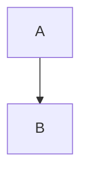

## Feature Description

A clear and concise description of the feature you'd like to see.

## Use Case

Describe the problem this feature would solve or the use case it enables.

**Example scenario:**
When I..., I want to..., so that...

## Proposed Solution

How do you envision this feature working?

**Example:**
```bash
mermaid-sonar --new-option docs/
```

## Alternatives Considered

Have you considered alternative solutions or workarounds?

## Research or References

If proposing a new rule or metric:
- Link to research papers, articles, or documentation
- Explain the theoretical basis
- Provide examples from other tools

## Example

Provide an example of how this feature would be used:

**Input:**


**Expected output:**
```
New feature output here
```

## Additional Context

Add any other context, screenshots, or examples about the feature request here.

## Willingness to Contribute

- [ ] I am willing to submit a pull request for this feature
- [ ] I can help with documentation
- [ ] I can help with testing
