# Rule Catalog

This document describes all complexity rules implemented in Mermaid-Sonar, their rationale, research backing, and how to configure them.

## Overview

Mermaid-Sonar implements eight research-backed rules for detecting complexity in Mermaid diagrams:

| Rule | Default Threshold | Severity | Research Basis |
|------|------------------|----------|----------------|
| [max-nodes](#max-nodes) | 50/100 (density-based) | error | Cognitive load research |
| [max-edges](#max-edges) | 100 connections | warning | Mermaid O(n²) complexity |
| [graph-density](#graph-density) | 0.3 | warning | Graph theory |
| [cyclomatic-complexity](#cyclomatic-complexity) | 15 | warning | Software engineering |
| [max-branch-width](#max-branch-width) | 8 parallel branches | error | Visual hierarchy |
| [layout-hint](#layout-hint) | enabled | info | Mermaid best practices |
| [horizontal-chain-too-long](#horizontal-chain-too-long) | LR: 8, TD: 12 | warning | Viewport constraints & UX |
| [horizontal-width-readability](#horizontal-width-readability) | 1200px target | warning | Viewport constraints & UX |
| [vertical-height-readability](#vertical-height-readability) | 800px target | warning | Viewport constraints & UX |

## Rule Details

### max-nodes

**Description**: Flags diagrams with too many nodes based on graph density.

**When it triggers**:
- High-density graphs (density > 0.3): More than 50 nodes
- Low-density graphs (density ≤ 0.3): More than 100 nodes

**Why it matters**:

Research on network visualization and cognitive load shows that humans struggle to comprehend large graphs. The threshold varies with density because dense graphs have more visual clutter:

- **High-density graphs** (many connections): 50-node limit based on "[Scalability of Network Visualisation from a Cognitive Load Perspective](https://arxiv.org/abs/2008.07944)"
- **Low-density graphs** (sparse connections): 100-node limit for tree-like structures

**Example that triggers the rule**:

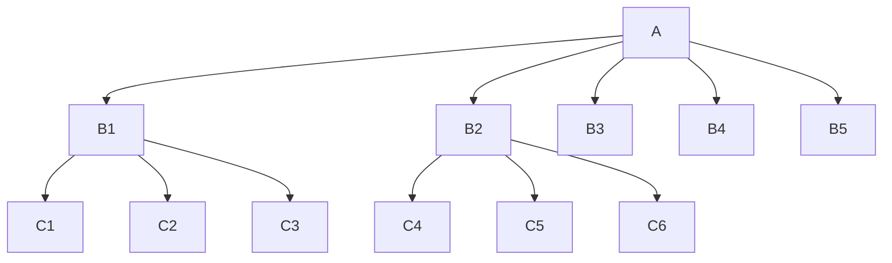

**How to fix**:

1. **Split into multiple diagrams**: Break the diagram into logical subcomponents
2. **Increase abstraction level**: Group related nodes into higher-level concepts
3. **Use references**: Link between smaller diagrams instead of one large one

**Configuration**:

```json
{
  "mermaid-sonar": {
    "rules": {
      "max-nodes": {
        "enabled": true,
        "high-density": 50,
        "low-density": 100,
        "density-threshold": 0.3,
        "severity": "error"
      }
    }
  }
}
```

**Options**:
- `enabled` (boolean): Enable/disable this rule
- `high-density` (number): Node limit for dense graphs (default: 50)
- `low-density` (number): Node limit for sparse graphs (default: 100)
- `density-threshold` (number): Density cutoff between high/low (default: 0.3)
- `severity` ("error" | "warning" | "info"): Rule severity

---

### max-edges

**Description**: Flags diagrams with too many connections (edges).

**When it triggers**:
- More than 100 connections between nodes

**Why it matters**:

Mermaid's layout algorithm has O(n²) complexity. According to the [Mermaid official blog](https://docs.mermaidchart.com/blog/posts/flow-charts-are-on2-complex-so-dont-go-over-100-connections):

> "Flow charts are O(n²) complex, so don't go over 100 connections"

Beyond 100 connections, rendering becomes slow and the diagram becomes difficult to maintain and understand.

**Example that triggers the rule**:

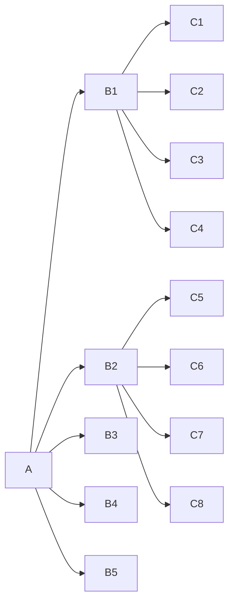

**How to fix**:

1. **Reduce connections**: Remove unnecessary or redundant edges
2. **Split diagram**: Divide into multiple focused diagrams
3. **Increase abstraction**: Group nodes to reduce connection count
4. **Use subgraphs**: Organize related nodes into subgraphs

**Configuration**:

```json
{
  "mermaid-sonar": {
    "rules": {
      "max-edges": {
        "enabled": true,
        "limit": 100,
        "severity": "warning"
      }
    }
  }
}
```

**Options**:
- `enabled` (boolean): Enable/disable this rule
- `limit` (number): Maximum allowed edges (default: 100)
- `severity` ("error" | "warning" | "info"): Rule severity

---

### graph-density

**Description**: Flags diagrams with excessive connection density.

**When it triggers**:
- Graph density exceeds 0.3 (30% of possible connections)

**Formula**:
```
density = edges / (nodes × (nodes - 1))
```

**Why it matters**:

Graph theory research shows that dense graphs (where many nodes connect to many other nodes) are harder to visualize and comprehend. A density above 0.3 indicates visual clutter that impairs readability.

**Example that triggers the rule**:

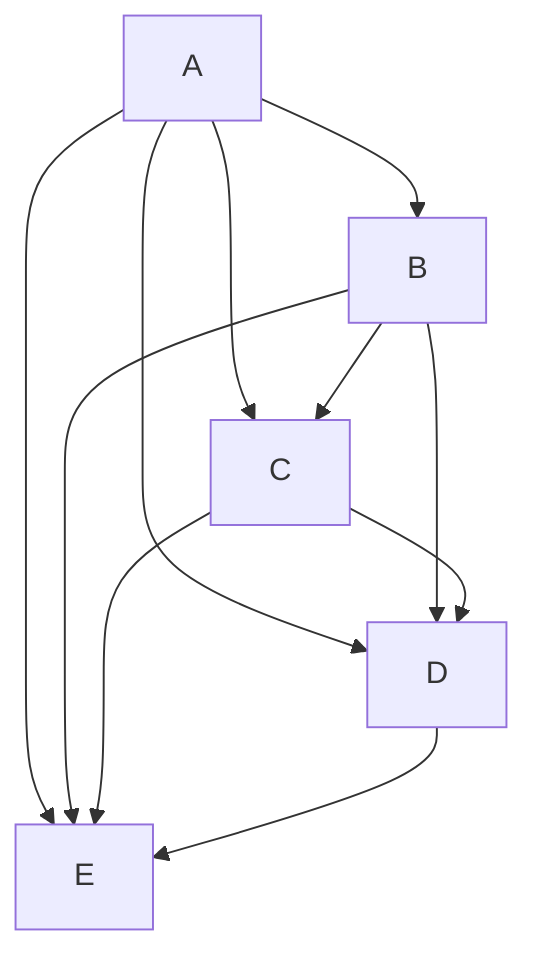

**How to fix**:

1. **Remove redundant connections**: Keep only essential edges
2. **Simplify relationships**: Consolidate similar connections
3. **Use hierarchy**: Convert mesh to tree structure if possible
4. **Split diagram**: Separate into less-connected components

**Configuration**:

```json
{
  "mermaid-sonar": {
    "rules": {
      "graph-density": {
        "enabled": true,
        "threshold": 0.3,
        "severity": "warning"
      }
    }
  }
}
```

**Options**:
- `enabled` (boolean): Enable/disable this rule
- `threshold` (number): Maximum density (0-1, default: 0.3)
- `severity` ("error" | "warning" | "info"): Rule severity

---

### cyclomatic-complexity

**Description**: Flags diagrams with high decision complexity.

**When it triggers**:
- Cyclomatic complexity exceeds 15

**Formula**:
```
complexity = edges - nodes + 2
```

**Why it matters**:

Cyclomatic complexity, originally defined by Thomas McCabe for code analysis, measures the number of independent paths through a structure. High complexity indicates:

- Many decision points
- Difficult to follow logic
- Hard to test/validate

Software engineering standards typically use 15 as a complexity threshold.

**Example that triggers the rule**:

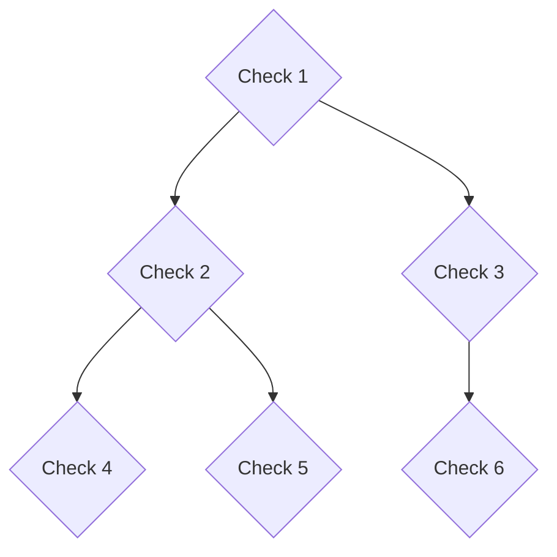

**How to fix**:

1. **Reduce branching**: Simplify decision logic
2. **Extract sub-diagrams**: Move decision trees to separate diagrams
3. **Use tables**: Consider decision tables for complex logic
4. **Flatten structure**: Reduce nesting levels

**Configuration**:

```json
{
  "mermaid-sonar": {
    "rules": {
      "cyclomatic-complexity": {
        "enabled": true,
        "limit": 15,
        "severity": "warning"
      }
    }
  }
}
```

**Options**:
- `enabled` (boolean): Enable/disable this rule
- `limit` (number): Maximum complexity (default: 15)
- `severity` ("error" | "warning" | "info"): Rule severity

---

### max-branch-width

**Description**: Flags tree diagrams with too many parallel branches from a single node.

**When it triggers**:
- Any node has more than 8 direct children

**Why it matters**:

Visual hierarchy research shows that humans struggle to scan and compare more than 7±2 items simultaneously (Miller's Law). In top-down (TD) diagrams, wide branches create horizontal scanning challenges.

Wide trees should use left-right (LR) layout instead, which handles horizontal expansion better.

**Example that triggers the rule**:

```mermaid
graph TD
  Root --> Child1 & Child2 & Child3 & Child4 & Child5
        & Child6 & Child7 & Child8 & Child9 & Child10
  %% 10 parallel branches - too many for TD layout
```

**How to fix**:

1. **Use LR layout**: `graph LR` instead of `graph TD` for wide trees
2. **Group children**: Introduce intermediate grouping nodes
3. **Split diagram**: Separate into multiple focused views
4. **Pagination**: Show subsets of branches

**Suggested fix for wide trees**:

```mermaid
graph LR
  Root --> Child1 & Child2 & Child3 & Child4 & Child5
        & Child6 & Child7 & Child8 & Child9 & Child10
  %% LR layout handles wide trees better
```

**Configuration**:

```json
{
  "mermaid-sonar": {
    "rules": {
      "max-branch-width": {
        "enabled": true,
        "limit": 8,
        "severity": "error"
      }
    }
  }
}
```

**Options**:
- `enabled` (boolean): Enable/disable this rule
- `limit` (number): Maximum children per node (default: 8)
- `severity` ("error" | "warning" | "info"): Rule severity

---

### layout-hint

**Description**: Suggests optimal layout direction based on diagram characteristics.

**When it triggers**:
- Wide tree (max branch width > 8) using TD layout
- Tall tree (max depth > 6) using LR layout

**Why it matters**:

Mermaid's layout direction significantly affects readability:

- **TD (top-down)**: Best for tall, narrow hierarchies
- **LR (left-right)**: Best for wide, shallow hierarchies

Using the wrong layout wastes space and requires excessive scrolling.

**Example that triggers the rule**:

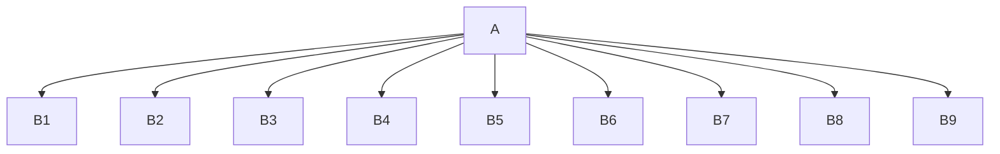

**How to fix**:

Follow the suggestion to switch layout:

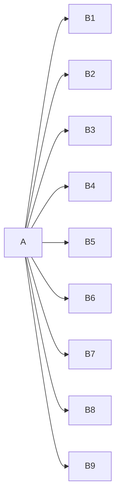

**Configuration**:

```json
{
  "mermaid-sonar": {
    "rules": {
      "layout-hint": {
        "enabled": true,
        "wide-threshold": 8,
        "tall-threshold": 6,
        "severity": "info"
      }
    }
  }
}
```

**Options**:
- `enabled` (boolean): Enable/disable this rule
- `wide-threshold` (number): Branch width triggering LR suggestion (default: 8)
- `tall-threshold` (number): Depth triggering TD suggestion (default: 6)
- `severity` ("error" | "warning" | "info"): Rule severity

---

### horizontal-chain-too-long

**Description**: Detects excessively long linear chains that create wide diagrams in horizontal layouts or tall diagrams in vertical layouts.

**When it triggers**:
- LR/RL layouts: Linear chain exceeds 8 nodes
- TD/TB layouts: Linear chain exceeds 12 nodes

**What is a linear chain?**

A linear chain is a sequence of nodes where each node has:
- At most 1 incoming edge
- At most 1 outgoing edge

Example: `A --> B --> C --> D --> E` is a 5-node linear chain.

**Why it matters**:

Long horizontal chains create poor user experience:
- **Excessive horizontal scrolling**: Users must scroll side-to-side to see the full diagram
- **Viewport constraints**: Wide diagrams don't fit standard screen widths (1280-1920px)
- **Poor readability**: Horizontal scrolling is less intuitive than vertical scrolling

Vertical layouts are more tolerant of long chains (12 nodes) because vertical scrolling is more natural.

**Bidirectional Validation**:

This rule also prevents the `layout-hint` rule from suggesting LR layout for TD diagrams with long chains (>8 nodes), ensuring consistent advice.

**Example that triggers the rule (LR layout)**:

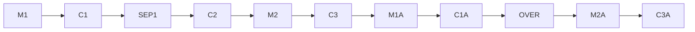

**Example that triggers the rule (TD layout)**:

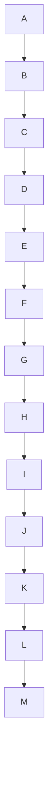

**How to fix**:

1. **Convert LR to TD layout** (for horizontal chains):
   ```mermaid
   graph TD
     M1 --> C1 --> SEP1
     SEP1 --> C2 --> M2
     M2 --> C3
   ```

2. **Organize into subgraphs** (break up long chains):
   ```mermaid
   graph TD
     subgraph Before
       direction TB
       M1 --> C1 --> SEP1
     end

     subgraph After
       direction TB
       C2 --> M2 --> C3
     end

     Before -.-> After
   ```

3. **Simplify by removing intermediate nodes**:
   ```mermaid
   graph LR
     Start --> KeyStep1 --> KeyStep2 --> End
   ```

**Configuration**:

```json
{
  "mermaid-sonar": {
    "rules": {
      "horizontal-chain-too-long": {
        "enabled": true,
        "thresholds": {
          "LR": 8,
          "TD": 12
        },
        "severity": "warning"
      }
    }
  }
}
```

**Options**:
- `enabled` (boolean): Enable/disable this rule
- `thresholds.LR` (number): Maximum chain length for LR/RL layouts (default: 8)
- `thresholds.TD` (number): Maximum chain length for TD/TB layouts (default: 12)
- `severity` ("error" | "warning" | "info"): Rule severity

---

### horizontal-width-readability

**Description**: Detects diagrams that will be too wide for standard viewports due to the combination of layout direction, node count, branching, and label length.

**When it triggers**:
- Estimated diagram width exceeds viewport thresholds based on:
  - **For LR/RL layouts**: Sequential nodes multiplied by average label length
  - **For TD/TB layouts**: Parallel branch width multiplied by average label length
- Three severity levels:
  - **Info**: Width ≥ 1500px
  - **Warning**: Width ≥ 2000px
  - **Error**: Width ≥ 2500px

**Why it matters**:

Excessive diagram width creates poor user experience regardless of layout direction:

- **Horizontal scrolling breaks UX**: Unlike vertical scrolling which is natural and expected, horizontal scrolling disrupts reading flow and comprehension
- **Text becomes illegibly small**: Wide diagrams must be scaled down to fit viewports (typically 1280-1920px)
- **Mobile/tablet unusable**: Wide diagrams are completely inaccessible on smaller screens
- **Combination effect**: This rule detects problems that occur when multiple factors combine (many nodes + long labels + layout direction) even when individual rules don't trigger

**Real-world example**: The ripgrep documentation's "overlapping matches" diagram demonstrates this issue - an LR layout with many nodes and long labels makes text illegibly small when scaled to fit viewports.

**Example that triggers the rule (LR layout)**:

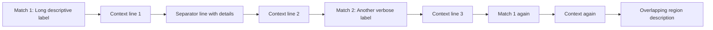

**Example that triggers the rule (TD layout with wide branches)**:

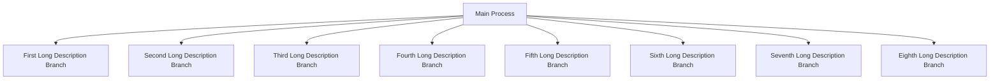

**How to fix**:

**For LR/RL layouts** (sequential width issue):
1. **Convert to TD layout** for better vertical scrolling:
   ```mermaid
   graph TD
     M1[Match 1] --> C1[Context 1]
     C1 --> SEP1[Separator]
     SEP1 --> C2[Context 2]
   ```

2. **Break into multiple diagrams**:
   ```mermaid
   graph LR
     %% Phase 1
     M1[Match 1] --> C1[Context] --> SEP1[Sep]
   ```
   ```mermaid
   graph LR
     %% Phase 2
     SEP1[Sep] --> C2[Context] --> M2[Match 2]
   ```

**For TD/TB layouts** (branching width issue):
1. **Group branches into subgraphs**:
   ```mermaid
   graph TD
     Root --> Group1[Group A]
     Root --> Group2[Group B]

     subgraph Group1
       Branch1 & Branch2 & Branch3
     end

     subgraph Group2
       Branch4 & Branch5 & Branch6
     end
   ```

2. **Split into focused diagrams**: Create separate diagrams for different aspects

**Common fixes for all layouts**:
1. **Use shorter labels**: Replace "First Long Description Branch" with "Branch 1" or "B1"
2. **Use abbreviations with legend**: Define abbreviations once, use throughout diagram
3. **Introduce intermediate nodes**: Group related concepts under summary nodes

**Configuration**:

```json
{
  "mermaid-sonar": {
    "rules": {
      "horizontal-width-readability": {
        "enabled": true,
        "targetWidth": 1200,
        "thresholds": {
          "info": 1500,
          "warning": 2000,
          "error": 2500
        },
        "charWidth": 8,
        "nodeSpacing": 50,
        "severity": "warning"
      }
    }
  }
}
```

**Options**:
- `enabled` (boolean): Enable/disable this rule
- `targetWidth` (number): Safe viewport width in pixels (default: 1200)
- `thresholds.info` (number): Width triggering info severity (default: 1500)
- `thresholds.warning` (number): Width triggering warning severity (default: 2000)
- `thresholds.error` (number): Width triggering error severity (default: 2500)
- `charWidth` (number): Estimated pixels per character (default: 8)
- `nodeSpacing` (number): Mermaid node spacing in pixels (default: 50)
- `severity` ("error" | "warning" | "info"): Override severity for all violations

**How width is calculated**:

- **LR/RL layouts**: `nodeCount × avgLabelLength × charWidth + nodeCount × nodeSpacing`
- **TD/TB layouts**: `maxBranchWidth × avgLabelLength × charWidth + maxBranchWidth × nodeSpacing`

This is an approximation that doesn't require actual rendering, providing fast feedback during development.

---

### vertical-height-readability

**Description**: Detects diagrams that exceed comfortable viewport heights, making it impossible to view all nodes simultaneously without scrolling.

**When it triggers**:
- Estimated diagram height exceeds viewport thresholds based on:
  - **For TD/TB layouts**: Graph depth (longest path from root to leaf)
  - **For LR/RL layouts**: Maximum parallel branch width
- Three severity levels:
  - **Info**: Height ≥ 800px
  - **Warning**: Height ≥ 1200px
  - **Error**: Height ≥ 2000px

**Why it matters**:

Excessive diagram height breaks the fundamental purpose of diagrams - showing relationships and flow at a glance:

- **Impossible to compare nodes**: Users cannot reference nodes scrolled out of view, breaking ability to trace relationships
- **Loss of context**: Scrolling removes surrounding nodes from view, making it hard to understand the big picture
- **Poor mental model**: Users struggle to build a complete mental model when they can't see the whole diagram
- **Reduced effectiveness**: The diagram becomes a documentation burden rather than a comprehension aid

Unlike width issues which are painful but workable, height issues fundamentally break diagram usability because users need to see multiple related nodes simultaneously to understand flow and relationships.

**Real-world examples that trigger the rule**:

**TD Layout - Deep Organizational Hierarchy** (depth-based height):
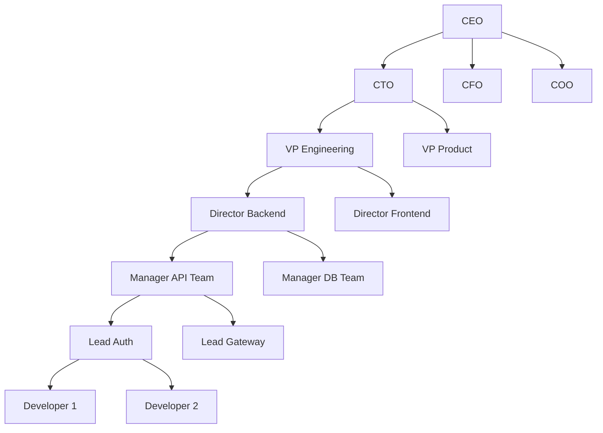

**TD Layout - Decision Tree** (depth-based height):
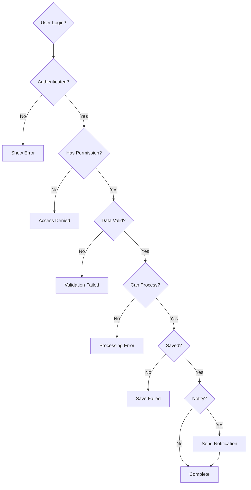

**LR Layout - Process Flow with Parallel Paths** (branching-based height):
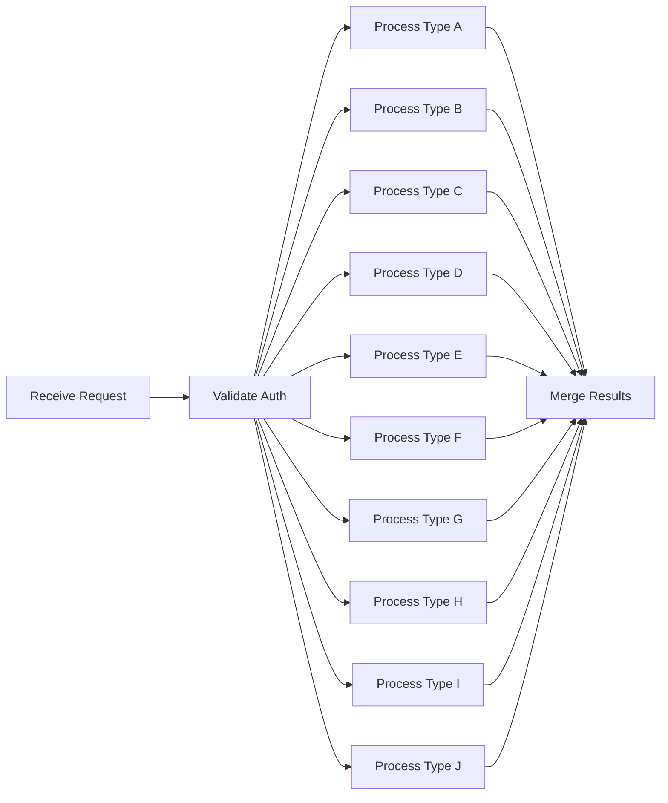

**LR Layout - State Machine** (branching-based height):
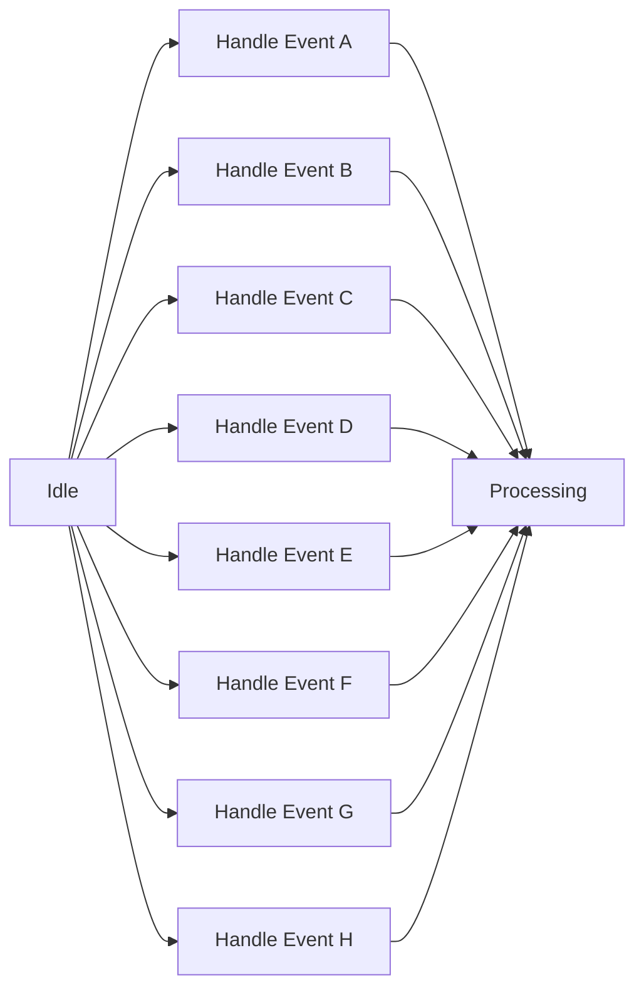

**How to fix**:

**For TD/TB layouts** (depth issue):

1. **Break into multiple diagrams organized by layers**:
   ```mermaid
   graph TD
     %% High-Level Overview
     CEO --> Executives[Executive Team]
     Executives --> Directors[Director Level]
     Directors --> Managers[Manager Level]
   ```
   ```mermaid
   graph TD
     %% Detailed: Engineering Track
     VPEng[VP Engineering] --> DirBackend[Director Backend]
     VPEng --> DirFrontend[Director Frontend]
     DirBackend --> Teams[Team Leads]
   ```

2. **Group intermediate nodes into subgraphs**:
   ```mermaid
   graph TD
     CEO --> Executives

     subgraph Executives
       direction TB
       CTO --> VPEng[VP Engineering]
       CFO --> VPFin[VP Finance]
       COO --> VPOps[VP Operations]
     end

     Executives --> Directors[Next Level]
   ```

3. **Abstract away some levels**: Not every intermediate step needs to be shown

4. **Use links between diagrams**: Reference separate diagrams instead of one deep hierarchy

**For LR/RL layouts** (wide branching issue):

1. **Convert to TD layout** to handle wide branching better:
   ```mermaid
   graph TD
     Start[Receive Request] --> ProcessGroup[Process Handlers]

     ProcessGroup --> ProcessA[Type A]
     ProcessGroup --> ProcessB[Type B]
     ProcessGroup --> ProcessC[Type C]
     %% ... continues vertically with better scrolling
   ```

2. **Group parallel branches into subgraphs**:
   ```mermaid
   graph LR
     Start --> Category1
     Start --> Category2

     subgraph Category1[Category A-E]
       ProcessA
       ProcessB
       ProcessC
       ProcessD
       ProcessE
     end

     subgraph Category2[Category F-J]
       ProcessF
       ProcessG
       ProcessH
       ProcessI
       ProcessJ
     end

     Category1 --> Merge
     Category2 --> Merge
   ```

3. **Split into multiple diagrams by category**: Show different functional areas separately

4. **Reduce number of parallel paths**: Consolidate similar branches

**Configuration**:

```json
{
  "mermaid-sonar": {
    "rules": {
      "vertical-height-readability": {
        "enabled": true,
        "targetHeight": 800,
        "thresholds": {
          "info": 800,
          "warning": 1200,
          "error": 2000
        },
        "nodeHeight": 40,
        "verticalSpacing": 50,
        "severity": "warning"
      }
    }
  }
}
```

**Options**:
- `enabled` (boolean): Enable/disable this rule
- `targetHeight` (number): Comfortable viewport height in pixels (default: 800)
- `thresholds.info` (number): Height triggering info severity (default: 800)
- `thresholds.warning` (number): Height triggering warning severity (default: 1200)
- `thresholds.error` (number): Height triggering error severity (default: 2000)
- `nodeHeight` (number): Mermaid node height in pixels (default: 40)
- `verticalSpacing` (number): Vertical spacing between nodes in pixels (default: 50)
- `severity` ("error" | "warning" | "info"): Override severity for all violations

**How height is calculated**:

- **TD/TB layouts**: `maxDepth × (nodeHeight + verticalSpacing)`
  - Depth is the longest path from any root node to any leaf node
  - Handles cycles by limiting traversal depth

- **LR/RL layouts**: `maxBranchWidth × (nodeHeight + verticalSpacing)`
  - Branch width is the maximum number of nodes at the same depth level
  - In LR layouts, wide branching creates vertical expansion

This is an approximation that doesn't require actual rendering, providing fast feedback during development.

**Coordination with horizontal-width-readability**:

These two rules work together to ensure diagrams fit within comfortable viewport boundaries:
- `vertical-height-readability`: Ensures diagrams aren't too tall (vertical scrolling)
- `horizontal-width-readability`: Ensures diagrams aren't too wide (horizontal scrolling)

The rules may suggest opposite layout changes (e.g., "convert LR to TD" vs "convert TD to LR"), which indicates the diagram is fundamentally too complex and should be split into multiple diagrams.

---

## Global Configuration

### Disabling Rules

Disable specific rules:

```json
{
  "mermaid-sonar": {
    "rules": {
      "max-edges": {
        "enabled": false
      },
      "layout-hint": {
        "enabled": false
      }
    }
  }
}
```

### Adjusting Severity

Change rule severity:

```json
{
  "mermaid-sonar": {
    "rules": {
      "max-nodes": {
        "severity": "warning"  // Instead of error
      },
      "graph-density": {
        "severity": "error"    // Instead of warning
      }
    }
  }
}
```

### Per-File Overrides

Use configuration cascading to override rules for specific directories:

```
project/
├── .sonarrc.json          # Global config
└── legacy-docs/
    └── .sonarrc.json      # Relaxed rules for legacy docs
```

## Research References

1. **Cognitive Load and Graph Visualization**
   - Yoghourdjian, V., et al. (2020). "Scalability of Network Visualisation from a Cognitive Load Perspective"
   - URL: https://arxiv.org/abs/2008.07944

2. **Mermaid Performance**
   - MermaidChart Blog. "Flow charts are O(n²) complex, so don't go over 100 connections"
   - URL: https://docs.mermaidchart.com/blog/posts/flow-charts-are-on2-complex-so-dont-go-over-100-connections

3. **Cyclomatic Complexity**
   - McCabe, T. J. (1976). "A Complexity Measure"
   - IEEE Transactions on Software Engineering

4. **Visual Perception**
   - Miller, G. A. (1956). "The Magical Number Seven, Plus or Minus Two"
   - Psychological Review

## Contributing New Rules

To propose a new rule:

1. Open a GitHub issue with:
   - Rule description and rationale
   - Research backing (citations)
   - Example diagrams that trigger it
   - Suggested thresholds

2. Include:
   - Clear definition of what constitutes a violation
   - Actionable fix suggestions
   - Configuration options

See [CONTRIBUTING.md](../CONTRIBUTING.md) for implementation guidelines.
