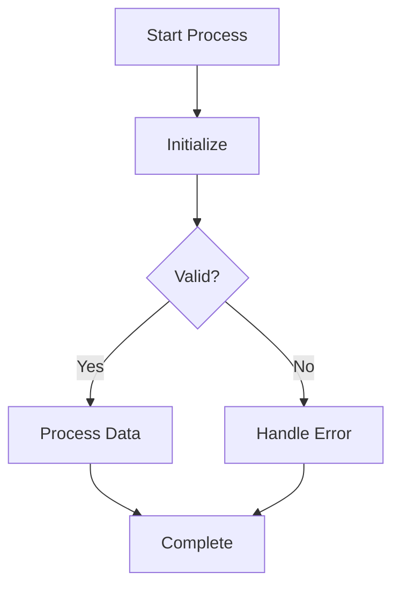
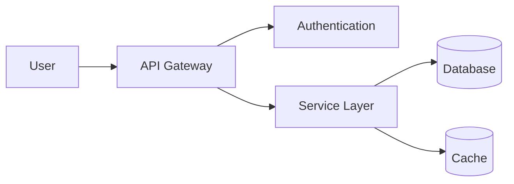

# Example Diagram

This is a sample markdown file with a Mermaid diagram for testing.

## Simple Flow

```mermaid
graph TD
  Start[Start Process] --> Init[Initialize]
  Init --> Check{Valid?}
  Check -->|Yes| Process[Process Data]
  Check -->|No| Error[Handle Error]
  Process --> Done[Complete]
  Error --> Done
```

## Architecture

```mermaid
flowchart LR
  User[User] --> API[API Gateway]
  API --> Auth[Authentication]
  API --> Service[Service Layer]
  Service --> DB[(Database)]
  Service --> Cache[(Cache)]
```

These diagrams should pass all default rules.
