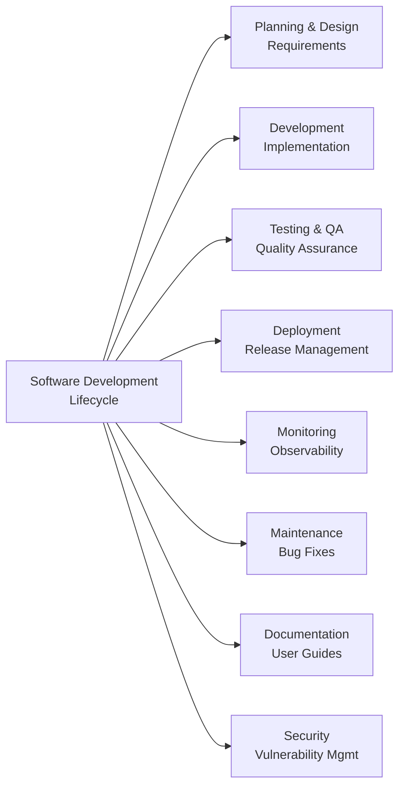

# Example 1 (After): Wide Tree with LR Layout

## Solution

Convert to LR layout - stacks branches vertically for natural scrolling.

**Fix**: Changed `graph TD` to `graph LR`



## Expected Validation Result

When running `npx mermaid-sonar --viewport-profile mkdocs` on this file:

```
✅ No issues found
```

## What Changed

- **TD layout with 8 parallel branches** = 1302px horizontal spread (63% over limit)
- **LR layout with 8 parallel branches** = ~400px vertical stacking (natural scrolling)
- Same node count and complexity
- Pure layout orientation change
- **Width improvement**: 1302px → ~400px (69% reduction)

## Compare

- Before: `example-1-before.md` (❌ 1302px ERROR - 502px over limit)
- After: `example-1-after.md` (✅ passes validation)
