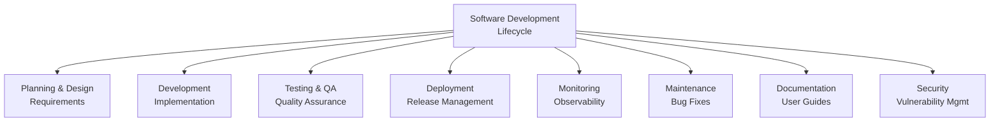

# Example 1 (Before): Wide Tree with TD Layout

## Problem

Wide tree diagrams with many parallel branches in TD layout create excessive horizontal width. With 8 parallel branches, this diagram exceeds viewport limits by 63%.

**Issue**: 8 parallel branches in TD layout = 1302px width (ERROR - 502px over 800px limit)



## Expected Validation Result

When running `npx mermaid-sonar --viewport-profile mkdocs` on this file:

```
❌ ERROR: Diagram width (1302px) exceeds viewport limit by 502px (63% over)
   This TD layout with 7 parallel branches creates excessive width.

   Suggestions:
   1. Group related branches into subgraphs to reduce width
   2. Convert to LR layout for vertical stacking
   3. Split wide branches into separate diagrams
```

## The Fix

See `example-1-after.md` for the corrected version using LR layout.
