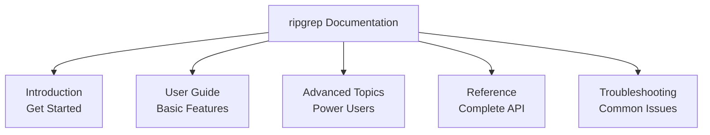

# Example 1 (Before): Wide Tree with TD Layout

## Problem

Wide tree diagrams in TD layout create excessive horizontal width when they have many parallel branches.

**Issue**: 5 parallel branches in TD layout = 712px width (warning threshold)



## Expected Validation Result

When running `npx mermaid-sonar --viewport-profile mkdocs` on this file:

```
⚠️  Diagram width (712px) exceeds viewport limit due to parallel branches
    Suggestions:
    1. Group related branches into subgraphs to reduce width
    2. Convert to LR layout for vertical stacking
```

## The Fix

See `example-1-after.md` for the corrected version using LR layout.
