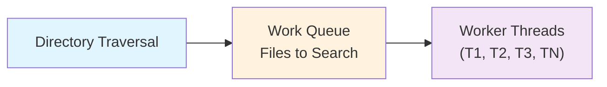
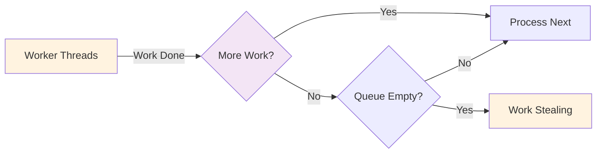
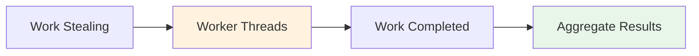

# Example 2 (After - Alternative): Split into Sequential Phases

## Alternative Solution: Split Diagram Approach

Instead of using subgraphs in TD layout, split the workflow into multiple smaller LR diagrams. This approach gets **zero warnings** because each phase is simple enough for LR layout.

**Strategy**: Break complex workflow into 3 focused diagrams

---

## Phase 1: Work Distribution



---

## Phase 2: Work Processing



---

## Phase 3: Result Aggregation



---

## Expected Validation Result

When running `npx mermaid-sonar --viewport-profile mkdocs` on this file:

```
✅ No issues found (all 3 diagrams)
✅ No layout hints
✅ Zero warnings
```

## Why This Works

- **Each diagram is simple** (3-5 nodes per diagram)
- **LR layout works perfectly** for each sequential phase
- **No width issues** (~400px per diagram)
- **Maintains left-to-right reading flow** (no TD tradeoff)

## Tradeoffs vs Single Subgraph Version

### Advantages
- ✅ Zero warnings (no layout hints)
- ✅ Each phase is clearer and more focused
- ✅ Can explain each phase separately in docs
- ✅ Easier to understand step-by-step

### Disadvantages
- ❌ Requires more vertical space (3 diagrams vs 1)
- ❌ Loses "big picture" view of entire workflow
- ❌ Readers must mentally connect phases

## When to Use This Approach

- ✅ Documentation with plenty of vertical space
- ✅ Workflows that naturally break into distinct phases
- ✅ When you want zero mermaid-sonar warnings
- ✅ Step-by-step tutorials or explanations
- ❌ When you need to show the whole system at once
- ❌ Space-constrained docs (slide decks, READMEs)

## Compare

- Before: `example-2-before.md` (⚠️ 712px width)
- After (subgraph): `example-2-after.md` (⚠️ layout hint)
- After (split): `example-2-after-alternative.md` (✅ zero warnings)
