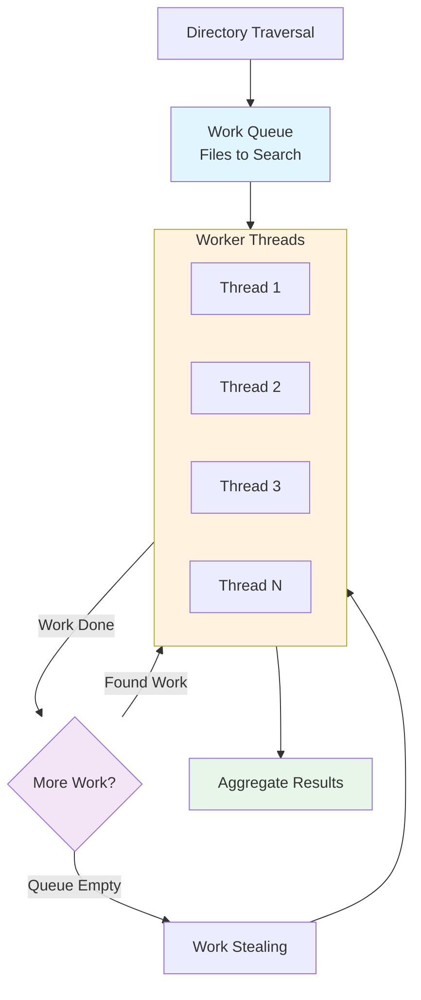

# Example 2 (After): Grouped with Subgraph

## Solution

Group related parallel nodes into a single subgraph unit.

**Fix**: Wrapped 4 thread nodes in a `subgraph Workers` block



## Expected Validation Result

When running `npx mermaid-sonar --viewport-profile mkdocs` on this file:

```
✅ No width errors
⚠️  Layout hint: Sequential flow detected (acceptable)
```

## What Changed

- **4 separate nodes** = 4 parallel branches = wide diagram
- **1 subgraph containing 4 nodes** = single visual unit = narrow diagram
- Eliminates duplicate edges (each thread → Results becomes Workers → Results)
- Consolidates complex interactions
- Width reduction: 712px → ~500px (28% improvement)

## Compare

- Before: `example-2-before.md` (⚠️ 712px width warning)
- After: `example-2-after.md` (✅ passes validation)
