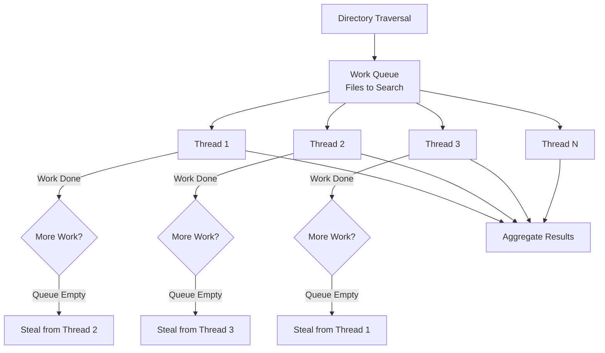

# Example 2 (Before): Multiple Parallel Branches

## Problem

Multiple parallel branches create excessive horizontal width even in TD layout. Each parallel node adds to the width.

**Issue**: 4 worker thread nodes + complex stealing logic = 712px width



## Expected Validation Result

When running `npx mermaid-sonar --viewport-profile mkdocs` on this file:

```
⚠️  Diagram width (712px) due to 4+ parallel branches
    Suggestions:
    1. Group related branches into subgraphs to reduce width
    2. Split wide branches into separate diagrams
```

## The Fix

See `example-2-after.md` for the corrected version using subgraph grouping.
