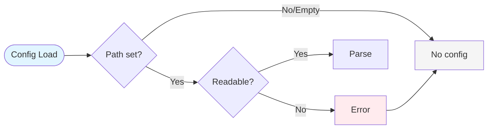
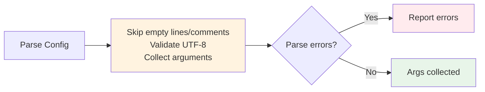
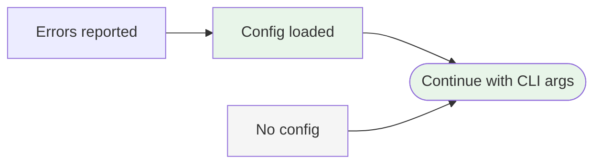

# Example 3 (After - Alternative): Split into Configuration Phases

## Alternative Solution: Split Diagram Approach

Instead of one 13-node TD diagram, split the config loading into 3 focused LR diagrams. This approach gets **zero warnings** because each phase is simple enough for LR layout.

**Strategy**: Break config loading into 3 logical phases

---

## Phase 1: Config Discovery and Loading



---

## Phase 2: Argument Processing



---

## Phase 3: Finalization



---

## Expected Validation Result

When running `npx mermaid-sonar --viewport-profile mkdocs` on this file:

```
✅ No issues found (all 3 diagrams)
✅ No layout hints
✅ Zero warnings
```

## Why This Works

- **Each diagram is simple** (3-5 nodes per diagram)
- **LR layout works perfectly** for each sequential phase
- **No width issues** (~350-450px per diagram)
- **Maintains left-to-right reading flow** (no TD tradeoff)
- **Natural story progression** (discovery → processing → finalization)

## Tradeoffs vs Single TD Diagram

### Advantages
- ✅ Zero warnings (no layout hints)
- ✅ Natural left-to-right flow for sequential processes
- ✅ Each phase stands alone for focused explanation
- ✅ Easier to digest (3 simple flows vs 1 complex flow)

### Disadvantages
- ❌ Requires more vertical space (3 diagrams vs 1)
- ❌ Loses overview of entire config loading process
- ❌ Readers must track state between diagrams
- ❌ More maintenance (3 diagrams to update vs 1)

## When to Use This Approach

- ✅ Documentation with plenty of vertical space
- ✅ Workflows with clear phase boundaries
- ✅ When you want zero mermaid-sonar warnings
- ✅ Tutorial-style docs explaining step-by-step
- ✅ Complex processes that benefit from decomposition
- ❌ When you need holistic system view
- ❌ Space-constrained environments
- ❌ When phases are tightly coupled

## Compare

- Before: `example-3-before.md` (❌ 64 nodes, complexity 45)
- After (simplified TD): `example-3-after.md` (⚠️ layout hint)
- After (split LR): `example-3-after-alternative.md` (✅ zero warnings)

## Key Insight

This demonstrates that there are **multiple valid solutions** to diagram complexity:

1. **Simplify + TD layout** = Good for viewport, gets layout hint
2. **Simplify + Split into LR** = Perfect validation, more vertical space
3. **Choose based on context**: docs layout, vertical space, need for overview vs detail
