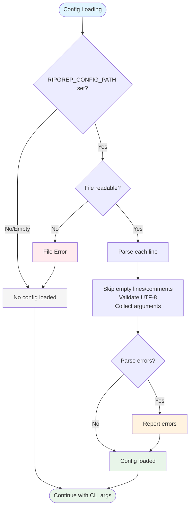

# Example 3 (After): Simplified 13-Node Flow with TD Layout

## Solution

Combine fine-grained operations into logical groups + use TD layout for narrow width.

**Fix**: Reduced from 64 nodes to 13 nodes + kept TD layout for viewport constraints



## Expected Validation Result

When running `npx mermaid-sonar --viewport-profile mkdocs` on this file:

```
✅ Cyclomatic complexity: 8 (well below threshold)
✅ Width: ~350px (within docs limit)
⚠️  Layout hint: Sequential flow detected, consider LR (acceptable)
```

## What Changed

### Simplification Strategy
- Merged "empty line" + "comment line" checks → "Skip empty lines/comments"
- Combined platform-specific error handling → single "Report errors" node
- Collapsed fine-grained loop mechanics into concept: "Parse each line"
- Reduced 64 nodes → 13 nodes (80% reduction)
- Reduced cyclomatic complexity from 45 → 8

### Layout Choice
- **TD layout** keeps width narrow (~350px)
- **LR layout would be** 1552px (fails validation by 752px!)
- Layout hint warning is acceptable - viewport constraints matter more

## Key Insight

The original diagram's problem was **complexity, not orientation**. The TD layout was fine for viewport—it just had too many nodes.

This demonstrates an important tradeoff:
- **Ideal**: LR layout for sequential flows (left-to-right reading)
- **Reality**: TD layout for documentation with narrow viewports
- **Decision**: Choose "readable in actual rendering" over "theoretically optimal"

## Compare

- Before: `example-3-before.md` (❌ 64 nodes, complexity 45)
- After: `example-3-after.md` (✅ 13 nodes, complexity 8)
