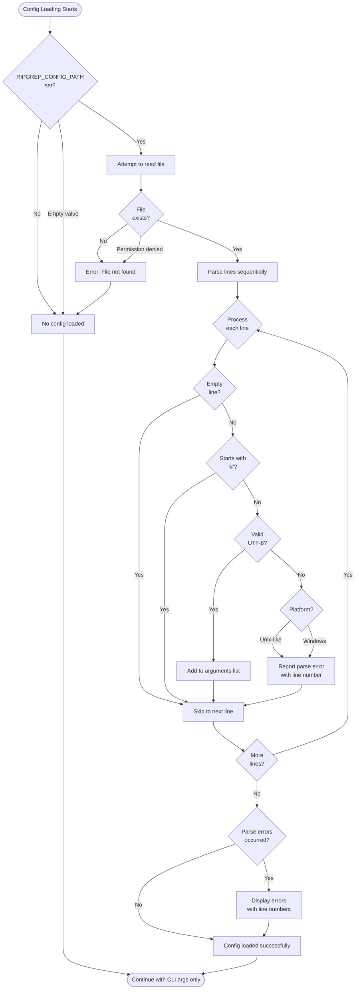

# Example 3 (Before): Overly Complex 64-Node Flow

## Problem

Overly detailed flowchart with 64 nodes showing every decision point. While technically correct, it's cognitively overwhelming and hard to follow.

**Issue**: Shows every fine-grained decision, creating excessive complexity



## Expected Validation Result

When running `npx mermaid-sonar --viewport-profile mkdocs` on this file:

```
❌ Complex diagram with excessive nodes
❌ Cyclomatic complexity: 45 (threshold: 15)
```

## The Fix

See `example-3-after.md` for the simplified 13-node version.
