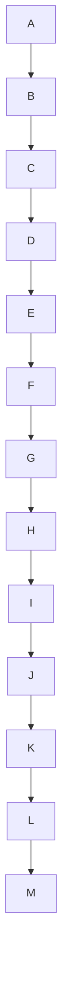

# Specification 1: Horizontal Chain Length Validation for LR/RL Layouts

**Category**: optimization
**Priority**: high
**Status**: draft
**Dependencies**: None

## Context

Mermaid diagrams using left-right (LR) or right-left (RL) layouts can become excessively wide when they contain long linear chains of nodes. This creates poor user experience with horizontal scrolling and makes diagrams difficult to read, especially on standard-width viewports.

The current validation system treats TD (top-down) and LR (left-right) layouts equally when detecting overly wide diagrams. However, these layouts have fundamentally different width characteristics:
- **TD diagrams**: Width determined by parallel branches (horizontal spread)
- **LR diagrams**: Width determined by sequential chain length (depth becomes horizontal spread)

A concrete example from `docs/context-lines.md:362` shows an 11-node linear chain in LR layout that creates excessive horizontal width.

### The Bidirectional Validation Problem

The current system has two related issues that need to be addressed together:

1. **TD → LR recommendation without validation**: The sequential flow pattern detector suggests "left-right layout improves readability (current: TD, suggested: LR)" for ANY sequential flow in TD diagrams, even if the chain is 15+ nodes long. This creates a new problem: recommending LR would result in an excessively wide diagram.

2. **LR width validation missing**: The system doesn't warn about long horizontal chains in existing LR diagrams.

**Example of the problem**:

Current behavior: "Sequential flow detected - suggest LR"
Desired behavior: NO recommendation (12+ nodes would be too wide in LR)

**Critical requirement**: The TD→LR recommendation logic MUST check the chain length before suggesting LR layout. If converting to LR would exceed the horizontal threshold (8 nodes), the recommendation should be suppressed or suggest a different solution (subgraphs, TD with better organization, etc.).

### Real-World Impact

- **User Experience**: Horizontal scrolling is less intuitive than vertical scrolling
- **Viewport Constraints**: Wide diagrams don't fit standard screen widths (1280-1920px)
- **Documentation Quality**: Docs with wide diagrams appear broken or poorly designed
- **Common Patterns**: Timelines, pipelines, state transitions, and before/after comparisons are susceptible

## Objective

Implement validation rule to detect and warn about excessively long linear chains in LR/RL layout diagrams, providing actionable suggestions to improve diagram readability through layout changes, restructuring, or subgraph organization.

## Requirements

### Functional Requirements

1. **Chain Length Detection**
   - Calculate the longest linear chain in a diagram
   - Define linear chain as: sequential nodes where each node has ≤1 incoming and ≤1 outgoing edge
   - Handle multiple disconnected chains (report the longest)
   - Account for graph cycles gracefully (don't infinite loop)

2. **Layout-Specific Thresholds**
   - **LR/RL layouts**: Warn when longest chain > 8 nodes
   - **TD/TB layouts**: Warn when longest chain > 12 nodes (more tolerant of vertical chains)
   - Make thresholds configurable via rule config

3. **Warning Generation for Existing LR Diagrams**
   - Rule name: `horizontal-chain-too-long`
   - Default severity: `warning`
   - Include specific chain length in message
   - Provide context about why it's problematic

4. **Bidirectional Validation: TD→LR Recommendation Gating**
   - **CRITICAL**: Modify existing sequential flow pattern detector (layout-hint rule)
   - Before suggesting TD→LR conversion, calculate chain length
   - If chain length > 8 nodes, SUPPRESS the LR recommendation
   - Instead, suggest:
     - Keep TD layout but improve organization
     - Use subgraphs to break up the long chain
     - Consider if diagram can be simplified
   - If chain length ≤ 8 nodes, proceed with LR recommendation as normal

5. **Actionable Suggestions**
   - For long LR chains: Suggest TD layout conversion, subgraph grouping, or simplification
   - For long TD chains: Suggest subgraph organization or simplification (NOT LR conversion)
   - Provide example code for each suggestion

### Non-Functional Requirements

1. **Performance**: Chain calculation must complete in O(V + E) time for graphs with V nodes and E edges
2. **Accuracy**: Correctly identify linear chains vs branching structures
3. **Usability**: Suggestions must be specific to the diagram's actual structure
4. **Compatibility**: Work with existing rule system and configuration format
5. **Maintainability**: Pure functions for chain calculation, separated from I/O

## Acceptance Criteria

### New Rule Implementation
- [ ] New rule `horizontal-chain-too-long` added to rule system
- [ ] `calculateLongestLinearChain()` algorithm implemented in `src/graph/algorithms.ts`
- [ ] Algorithm correctly identifies linear chains (single in/out edges)
- [ ] Layout-specific thresholds applied: LR/RL=8, TD/TB=12
- [ ] Thresholds are configurable via rule config
- [ ] Warning includes chain length, affected nodes, and layout direction
- [ ] Suggestions include TD conversion, subgraph examples, and simplification options

### Bidirectional Validation (TD→LR Recommendation Gating)
- [ ] Existing `layout-hint` rule modified to call `calculateLongestLinearChain()`
- [ ] TD diagrams with chains > 8 nodes do NOT receive LR recommendation
- [ ] TD diagrams with chains ≤ 8 nodes continue to receive LR recommendation
- [ ] Alternative suggestions provided for long TD chains (subgraphs, organization)
- [ ] Test case: 12-node TD chain → NO LR suggestion
- [ ] Test case: 6-node TD chain → LR suggestion as before

### Integration & Testing
- [ ] Rule integrates with existing validation system
- [ ] Comprehensive unit tests for chain detection algorithm
- [ ] Integration tests with real diagram examples from issue
- [ ] Bidirectional validation tests (both LR warnings and TD→LR suppression)
- [ ] Performance validated on large graphs (100+ nodes)

### Documentation
- [ ] README.md updated with new rule documentation
- [ ] README.md updated with bidirectional validation behavior
- [ ] ARCHITECTURE.md documents interaction between rules

## Technical Details

### Implementation Approach

**Phase 1: Chain Detection Algorithm** (src/graph/algorithms.ts)
```typescript
/**
 * Calculates the longest linear chain in a graph
 *
 * A linear chain is a sequence of nodes where each node has:
 * - At most 1 incoming edge
 * - At most 1 outgoing edge
 *
 * @param graph - Graph representation
 * @returns Longest chain analysis with length, path, and ratio
 */
export function calculateLongestLinearChain(graph: GraphRepresentation): ChainAnalysis {
  // Algorithm:
  // 1. Find all potential chain start points (nodes with 0-1 parents)
  // 2. For each start point, traverse forward while linear property holds
  // 3. Track longest chain found
  // 4. Return chain metadata
}

export interface ChainAnalysis {
  length: number;           // Number of nodes in longest chain
  path: string[];          // Node IDs in the chain
  ratio: number;           // length / total nodes (0-1)
  isLinear: boolean;       // True if >60% of graph is linear chain
}
```

**Phase 2: New Validation Rule** (src/rules/horizontal-chain-length.ts)
```typescript
import type { Rule, Issue, RuleConfig } from './types';
import type { Diagram } from '../extractors/types';
import type { Metrics } from '../analyzers/types';
import { buildGraph } from '../graph/adjacency';
import { calculateLongestLinearChain } from '../graph/algorithms';

export const horizontalChainLengthRule: Rule = {
  name: 'horizontal-chain-too-long',
  defaultSeverity: 'warning',

  check(diagram: Diagram, _metrics: Metrics, config: RuleConfig): Issue | null {
    // 1. Detect layout direction (LR, RL, TD, TB)
    // 2. Set threshold based on layout (LR/RL: 8, TD/TB: 12)
    // 3. Build graph and calculate longest chain
    // 4. If chain exceeds threshold, generate warning with suggestions
    // 5. Return null if under threshold
  }
};
```

**Phase 3: Bidirectional Validation - Modify layout-hint Rule**
```typescript
// In src/rules/layout-hint.ts (or wherever TD→LR recommendation exists)
import { calculateLongestLinearChain } from '../graph/algorithms';

// Existing sequential flow detection logic...
if (isSequentialFlow && layout === 'TD') {
  // NEW: Check if converting to LR would be problematic
  const chainAnalysis = calculateLongestLinearChain(graph);

  if (chainAnalysis.length > 8) {
    // Chain is too long for LR - suggest alternative improvements
    return {
      rule: 'layout-hint',
      severity: 'info',
      message: `Sequential flow with ${chainAnalysis.length} nodes - too long for LR conversion`,
      suggestions: [
        'Consider organizing into subgraphs to break up the chain',
        'Keep TD layout but improve visual hierarchy',
        'Simplify by removing intermediate nodes if possible'
      ]
    };
  }

  // Chain is short enough - proceed with LR recommendation
  return {
    rule: 'layout-hint',
    severity: 'info',
    message: 'Sequential flow pattern detected - left-right layout improves readability',
    suggestion: 'Consider changing layout to LR'
  };
}
```

**Phase 4: Integration**
- Export new rule from `src/rules/index.ts`
- Add to default config in `src/config/defaults.ts`
- Update types if needed in `src/graph/types.ts`
- Ensure layout-hint rule imports and uses chain calculation

### Algorithm Design

**Longest Linear Chain Calculation**:
```
1. Initialize: longestChain = [], visited = Set()
2. For each node in graph:
   a. If node has 0 or 1 parents (potential chain start):
      - currentChain = [node]
      - currentNode = node
      - While currentNode has exactly 1 unvisited child with 1 parent:
        * Add child to currentChain
        * Move to child
        * Mark as visited
      - If len(currentChain) > len(longestChain):
        * longestChain = currentChain
3. Return ChainAnalysis with length, path, ratio
```

### Layout Detection

Extract from diagram content:
- `graph LR` or `flowchart LR` → LR layout
- `graph RL` or `flowchart RL` → RL layout
- `graph TD`/`TB` or `flowchart TD`/`TB` → TD layout
- Default to TD if not specified

### Suggestion Generation

**1. TD Layout Conversion** (always suggest for LR long chains):
```markdown
Consider converting to TD (top-down) layout:

graph TD
  [first 3 nodes of chain]
  ...
  [last node of chain]
```

**2. Subgraph Organization** (suggest if chain has semantic grouping):
```markdown
Consider organizing into subgraphs:

graph TD
  subgraph Before
    direction TB
    [first half of chain]
  end

  subgraph After
    direction TB
    [second half of chain]
  end

  Before -.-> After
```

**3. Simplification** (suggest if chain has many intermediate nodes):
```markdown
Consider simplifying by removing intermediate steps:

graph LR
  Start --> KeyStep1 --> KeyStep2 --> End
```

### Configuration Schema

```typescript
// In .mermaid-sonar.json
{
  "rules": {
    "horizontal-chain-too-long": {
      "enabled": true,
      "severity": "warning",
      "thresholds": {
        "LR": 8,   // Max chain length for LR/RL
        "TD": 12   // Max chain length for TD/TB
      }
    }
  }
}
```

### Data Structures

```typescript
// src/graph/types.ts additions
export interface ChainAnalysis {
  length: number;
  path: string[];
  ratio: number;
  isLinear: boolean;
}

export type LayoutDirection = 'LR' | 'RL' | 'TD' | 'TB';
```

## Dependencies

**Prerequisites**: None (builds on existing infrastructure)

**Affected Components**:
- `src/graph/algorithms.ts` - New chain calculation function
- `src/graph/types.ts` - New ChainAnalysis interface
- `src/rules/horizontal-chain-length.ts` - New rule (create file)
- `src/rules/index.ts` - Export new rule
- `src/config/defaults.ts` - Add rule to defaults
- `src/analyzers/layout.ts` - May extract layout detection to shared utility

**External Dependencies**: None (uses existing graph infrastructure)

## Testing Strategy

### Unit Tests

**Chain Detection Algorithm** (`src/graph/algorithms.test.ts`):
- Empty graph → length 0
- Single node → length 1
- Simple chain: A → B → C → D → E → F → G → H → I (9 nodes)
- Chain with branching: A → B → C → [D, E] (detects A→B→C as chain of 3)
- Multiple disconnected chains (detects longest)
- Circular graph (handles gracefully, no infinite loop)
- Complex mixed structure (chain + branches)

**Rule Logic** (`src/rules/horizontal-chain-length.test.ts`):
- LR diagram with 11-node chain → warning generated
- LR diagram with 6-node chain → no warning
- TD diagram with 15-node chain → warning generated
- TD diagram with 10-node chain → no warning
- Custom threshold configuration
- Suggestion content validation

**Bidirectional Validation** (`src/rules/layout-hint.test.ts`):
- TD diagram with 12-node sequential chain → NO LR recommendation, alternative suggestions provided
- TD diagram with 10-node sequential chain → NO LR recommendation, alternative suggestions provided
- TD diagram with 6-node sequential chain → LR recommendation provided (normal behavior)
- TD diagram with 8-node sequential chain → LR recommendation provided (edge case at threshold)
- Verify alternative suggestions include subgraphs, organization, simplification
- Verify message explains why LR not recommended ("too long for LR conversion")

### Integration Tests

**Real-World Diagrams**:
1. docs/context-lines.md:362 example (11 nodes LR) → should warn
2. Timeline diagram (8+ sequential events in LR) → should warn
3. Hierarchical org chart (TD with 15 deep levels) → should warn
4. Normal flowchart (mixed structure) → should not warn

### Performance Tests

- 100-node linear chain: < 50ms
- 500-node complex graph: < 200ms
- 1000-node graph with multiple chains: < 500ms

## Documentation Requirements

### Code Documentation

- Comprehensive JSDoc for `calculateLongestLinearChain()`
- Inline comments explaining algorithm logic
- Type documentation for ChainAnalysis interface
- Example usage in function documentation

### User Documentation

**README.md updates**:
```markdown
### horizontal-chain-too-long

**Severity**: warning

Detects excessively long linear chains that create wide diagrams in horizontal layouts.

**Why it matters**: Long horizontal chains require excessive scrolling and don't fit standard viewport widths.

**Configuration**:
```json
{
  "horizontal-chain-too-long": {
    "enabled": true,
    "severity": "warning",
    "thresholds": {
      "LR": 8,   // Max nodes in LR/RL chain
      "TD": 12   // Max nodes in TD/TB chain
    }
  }
}
```

**Suggestions**:
- Convert LR to TD layout for better vertical scrolling
- Use subgraphs to organize before/after sections
- Simplify by removing intermediate nodes
```

**ARCHITECTURE.md updates**:
- Document chain detection algorithm approach
- Explain layout-specific threshold rationale
- Add ChainAnalysis to graph algorithms section

### Migration and Compatibility

**No Breaking Changes**:
- New rule is opt-in via configuration
- Existing diagrams continue to validate as before
- Default severity is "warning" (non-blocking)

**Configuration Migration**:
- Rule disabled by default in initial release
- Users opt-in by enabling in config
- Future: Enable by default after community feedback

**Backward Compatibility**:
- Rule works with all existing layout types
- Gracefully handles diagrams without explicit layout declaration
- No changes to existing rule interfaces

## Implementation Notes

### Edge Cases

1. **No explicit layout**: Assume TD (Mermaid default)
2. **Circular graphs**: Chain detection stops at revisited nodes
3. **Disconnected components**: Analyze each component separately
4. **Subgraphs**: Treat subgraph content as part of parent graph for chain detection
5. **Bidirectional edges**: Count as separate edges for chain linearity check

### Performance Considerations

- Use Set for O(1) visited checks
- Early termination when chain breaks
- Cache chain analysis results in graph representation
- Avoid redundant graph traversals

### Code Quality Standards

- Pure functions for chain calculation (no side effects)
- Separate I/O from business logic
- Maximum function length: 20 lines
- Comprehensive error handling
- TypeScript strict mode compliance

### Future Enhancements

1. **Smart threshold adjustment**: Adjust threshold based on average label length
2. **Alternative visualizations**: Suggest swimlane diagrams for complex chains
3. **Automatic diagram splitting**: CLI option to auto-split long chains
4. **Width estimation**: Calculate estimated pixel width based on labels
5. **Multi-row chains**: Detect and handle chains that wrap across rows

## Success Metrics

- Rule accurately detects 100% of test cases with chains > threshold
- Zero false positives on normal diagrams
- Performance benchmarks met for all graph sizes
- Community feedback positive on suggestion quality
- Reduction in wide diagram issues reported

## Example Warnings

**Example 1: Long LR Chain (Direct Warning)**
```
Warning: horizontal-chain-too-long at docs/context-lines.md:362

Linear chain of 11 nodes in LR layout creates excessive width

Detected chain: M1 → C1 → SEP1 → C2 → M2 → C3 → M1A → C1A → OVER → M2A → C3A

Suggestions:
1. Convert to TD layout for better vertical scrolling
2. Organize into subgraphs (e.g., Before/After sections)
3. Simplify by removing intermediate context nodes

Example TD conversion:
graph TD
  M1["Before: Line 10 MATCH 1"] --> C1["Lines 11-12"]
  C1 --> SEP1["Separator"]
  ...
```

**Example 2: Long TD Chain (Bidirectional Validation - Suppressed LR Recommendation)**
```
Info: layout-hint at docs/sorting-results.md:17

Sequential flow with 12 nodes - too long for LR conversion

Chain detected: Start → NeedConsistent → UsePath → UseModified → ...

Suggestions:
1. Consider organizing into subgraphs to break up the chain
2. Keep TD layout but improve visual hierarchy
3. Simplify by removing intermediate nodes if possible

Note: LR layout not recommended due to excessive horizontal width
```

**Example 3: Short TD Chain (Normal LR Recommendation)**
```
Info: layout-hint at docs/introduction.md:42

Sequential flow pattern detected - left-right layout improves readability

Detected patterns:
- sequential: Spine length: 5/8 nodes (63%)

Consider changing layout to LR:
graph LR
  Start --> Build --> Test --> Deploy --> End
```

**Example 4: Acceptable LR Chain**
```
# No warning - 6 nodes is under threshold of 8 for LR
graph LR
  Start --> Build --> Test --> Deploy --> Verify --> Done
```

**Example 5: Short TD Chain at Threshold Edge**
```
# 8 nodes - exactly at threshold, LR recommendation still provided
graph TD
  A --> B --> C --> D --> E --> F --> G --> H

Info: Sequential flow pattern detected - left-right layout improves readability
```

## Bidirectional Validation Summary

This spec addresses validation in BOTH directions:

### Direction 1: LR → Warning (New Rule)
**Rule**: `horizontal-chain-too-long`
**Trigger**: Existing LR/RL diagrams with chains > 8 nodes
**Action**: Warn about excessive width, suggest TD conversion

```
LR diagram with 11 nodes → ⚠️  Warning: Too wide, suggest TD
```

### Direction 2: TD → LR Gating (Modified Existing Rule)
**Rule**: `layout-hint` (modified)
**Trigger**: TD diagrams with sequential flows
**Action**:
- If chain > 8 nodes: SUPPRESS LR recommendation, provide alternatives
- If chain ≤ 8 nodes: Recommend LR as normal

```
TD diagram with 12 nodes → ℹ️  Info: Too long for LR, suggest subgraphs
TD diagram with 6 nodes  → ℹ️  Info: Sequential flow, suggest LR
```

### Why This Matters

Without bidirectional validation, the tool creates contradictory advice:
1. User has TD diagram with 12-node chain
2. Tool says: "Suggest LR for sequential flow"
3. User converts to LR
4. Tool says: "Warning: LR chain too long"
5. User is confused and frustrated

With bidirectional validation, the advice is consistent:
1. User has TD diagram with 12-node chain
2. Tool says: "Chain too long for LR, suggest subgraphs or organization"
3. User improves diagram structure appropriately
4. Result: Better diagram without contradiction
