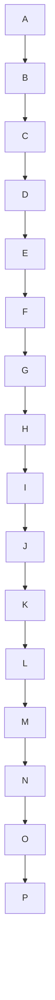

# Specification 002: Vertical Height Readability Rule

**Category**: optimization
**Priority**: high
**Status**: draft
**Dependencies**: None

## Context

While the `horizontal-width-readability` rule (spec 001) addresses diagrams that are too wide for viewports, there's an equally important readability problem with **vertical height**.

When a diagram exceeds the viewport height, users must scroll to see different parts. This creates a critical usability issue: **you cannot compare or reference nodes that are scrolled out of view**. This breaks the fundamental purpose of diagrams - to show relationships and flow at a glance.

### Height Issues by Layout

**TD/TB Layouts (Top-Down)**:
- Height determined by **depth** (longest path from root to leaf)
- Deep hierarchies create tall diagrams
- Common in organizational charts, decision trees, file system hierarchies

**LR/RL Layouts (Left-Right)**:
- Height determined by **maximum branch width** (parallel branches)
- Wide branching creates vertical expansion
- Common in process flows with many parallel paths

### Real-World Impact

A diagram that requires scrolling to view all nodes:
- Breaks visual comparison between distant nodes
- Makes it hard to trace paths through the diagram
- Requires mental effort to remember off-screen content
- Defeats the purpose of visual representation

Standard viewport heights:
- Laptop: 768px (1366×768), 900px (1440×900)
- Desktop: 1080px (1920×1080), 1440px (2560×1440)
- Comfortable reading: ~800px (leaves room for browser chrome, headers)

## Objective

Implement a `vertical-height-readability` rule that detects when diagrams exceed comfortable viewport heights due to depth (TD/TB) or branching (LR/RL), ensuring all nodes remain visible without excessive scrolling.

## Requirements

### Functional Requirements

1. **Detect layout direction**
   - Parse diagram content to identify layout: `LR`, `RL`, `TD`, `TB`
   - Apply layout-specific height calculation logic

2. **Calculate graph depth metrics** (for TD/TB)
   - Find root nodes (nodes with no incoming edges)
   - Calculate maximum depth from each root using DFS
   - Use `calculateMaxDepth()` from existing graph algorithms

3. **Use max branch width** (for LR/RL)
   - Already available in `metrics.maxBranchWidth`
   - Represents maximum parallel branches (vertical expansion)

4. **Estimate vertical height** (layout-specific)

   **For TD/TB layouts**:
   ```
   height = maxDepth × (nodeHeight + verticalSpacing)
   height = maxDepth × (40px + 50px) = maxDepth × 90px
   ```

   **For LR/RL layouts**:
   ```
   height = maxBranchWidth × (nodeHeight + verticalSpacing)
   height = maxBranchWidth × 90px
   ```

   Where:
   - `nodeHeight` ≈ 40px (Mermaid default box height)
   - `verticalSpacing` ≈ 50px (spacing between layers)

5. **Apply height thresholds**
   - Target: 800px (single viewport, comfortable)
   - Warning: 1200px (exceeds laptop screens, requires scrolling)
   - Error: 2000px+ (severely tall, unusable)

6. **Generate actionable suggestions** (layout-specific)

   **For TD/TB layouts** (depth problem):
   - Suggest breaking into multiple diagrams by layers
   - Suggest grouping intermediate nodes
   - Suggest reducing depth by abstracting levels
   - Note: Do NOT suggest LR conversion (would worsen width)

   **For LR/RL layouts** (branching problem):
   - Suggest converting to TD layout (better for wide branching)
   - Suggest grouping parallel branches into subgraphs
   - Suggest splitting into multiple diagrams

7. **Coordinate with existing rules**
   - Don't duplicate `max-branch-width` warnings
   - Provide unique value by considering actual height impact
   - Work with `horizontal-width-readability` (both can trigger)

### Non-Functional Requirements

1. **Performance**
   - Rule execution should complete in <50ms for typical diagrams
   - Depth calculation should be O(n) where n = number of nodes
   - No dependency on external rendering engines

2. **Accuracy**
   - False positive rate <10%
   - Should catch 90%+ of problematic tall diagrams
   - Thresholds validated against real-world examples

3. **Configurability**
   - All thresholds configurable via `.sonarrc.json`
   - Default values work for 80% of use cases
   - Support for disabling rule entirely

## Acceptance Criteria

- [ ] Rule detects all layout directions correctly (LR, RL, TD, TB)
- [ ] Calculates max depth for TD/TB layouts using graph algorithms
- [ ] Uses max branch width for LR/RL height calculation
- [ ] Implements height estimation with configurable node/spacing sizes
- [ ] Triggers at appropriate thresholds (validated against test cases)
- [ ] Generates layout-specific actionable suggestions
- [ ] Does NOT trigger on diagrams within comfortable height limits
- [ ] Does NOT suggest LR for tall TD diagrams (would worsen width)
- [ ] Configurable via `.sonarrc.json` with all thresholds exposed
- [ ] Integrated into rule registry (`src/rules/index.ts`)
- [ ] Added to default config (`src/config/defaults.ts`)
- [ ] Documented in `docs/rules.md` with examples for both TD and LR cases
- [ ] Unit tests cover both TD (depth) and LR (branching) height calculations
- [ ] Integration tests include real-world examples
- [ ] Performance validated (<50ms execution time)
- [ ] Works harmoniously with `horizontal-width-readability` rule

## Technical Details

### Implementation Approach

1. **Create new rule file**: `src/rules/vertical-height-readability.ts`

2. **Layout detection logic**:
   ```typescript
   function detectLayout(diagram: Diagram): LayoutDirection {
     // Reuse from horizontal-width-readability
     // Returns: 'LR' | 'RL' | 'TD' | 'TB'
   }
   ```

3. **Depth calculation** (for TD/TB):
   ```typescript
   function calculateDiagramDepth(graph: GraphRepresentation): number {
     const roots = findRootNodes(graph);

     if (roots.length === 0) {
       // No clear root - use all nodes as potential starts
       return Math.max(...graph.nodes.map(node =>
         calculateMaxDepth(graph, node)
       ));
     }

     // Return maximum depth from any root
     return Math.max(...roots.map(root =>
       calculateMaxDepth(graph, root)
     ));
   }
   ```

4. **Height estimation** (layout-specific):
   ```typescript
   function estimateHeight(
     layout: LayoutDirection,
     metrics: Metrics,
     graph: GraphRepresentation,
     config: RuleConfig
   ): number {
     const nodeHeight = (config.nodeHeight as number) ?? 40;
     const verticalSpacing = (config.verticalSpacing as number) ?? 50;
     const layerHeight = nodeHeight + verticalSpacing;

     if (layout === 'TD' || layout === 'TB') {
       // Vertical layouts: height = depth
       const depth = calculateDiagramDepth(graph);
       return depth * layerHeight;
     } else {
       // Horizontal layouts: height = max branching
       return metrics.maxBranchWidth * layerHeight;
     }
   }
   ```

5. **Height scoring**:
   ```typescript
   interface HeightScore {
     estimatedHeight: number;
     targetHeight: number;
     exceedsBy: number;
     severity: Severity | null;
   }

   function calculateHeightScore(estimatedHeight: number, config: RuleConfig): HeightScore {
     const targetHeight = (config.targetHeight as number) ?? 800;
     const thresholds = (config.thresholds as any) ?? {};
     const infoThreshold = thresholds.info ?? 800;
     const warningThreshold = thresholds.warning ?? 1200;
     const errorThreshold = thresholds.error ?? 2000;

     const exceedsBy = Math.max(0, estimatedHeight - targetHeight);

     let severity: Severity | null = null;
     if (estimatedHeight >= errorThreshold) {
       severity = 'error';
     } else if (estimatedHeight >= warningThreshold) {
       severity = 'warning';
     } else if (estimatedHeight >= infoThreshold) {
       severity = 'info';
     }

     return { estimatedHeight, targetHeight, exceedsBy, severity };
   }
   ```

6. **Threshold configuration**:
   ```json
   {
     "vertical-height-readability": {
       "enabled": true,
       "severity": "warning",
       "targetHeight": 800,
       "thresholds": {
         "info": 800,
         "warning": 1200,
         "error": 2000
       },
       "nodeHeight": 40,
       "verticalSpacing": 50
     }
   }
   ```

### Architecture Changes

- **New file**: `src/rules/vertical-height-readability.ts` (implements `Rule` interface)
- **Modified**: `src/rules/index.ts` (register new rule)
- **Modified**: `src/config/defaults.ts` (add default config)
- **Modified**: `docs/rules.md` (document new rule with TD and LR examples)

### Data Structures

```typescript
interface HeightAnalysis {
  layout: LayoutDirection;
  estimatedHeight: number;
  targetHeight: number;
  exceedsBy: number;
  severity: Severity | null;
  heightSource: 'depth' | 'branching';  // TD vs LR
  maxDepth?: number;  // For TD/TB
  maxBranchWidth?: number;  // For LR/RL
}
```

### APIs and Interfaces

The rule implements the standard `Rule` interface:

```typescript
export const verticalHeightReadabilityRule: Rule = {
  name: 'vertical-height-readability',
  defaultSeverity: 'warning',

  check(diagram: Diagram, metrics: Metrics, config: RuleConfig): Issue | null {
    const layout = detectLayout(diagram);
    const graph = buildGraph(diagram);
    const estimatedHeight = estimateHeight(layout, metrics, graph, config);
    const heightScore = calculateHeightScore(estimatedHeight, config);

    if (!heightScore.severity) return null;

    return generateIssue(layout, heightScore, diagram);
  }
}
```

## Dependencies

- **Prerequisites**: None (standalone rule)
- **Affected Components**:
  - `src/rules/index.ts` (rule registry)
  - `src/config/defaults.ts` (default config)
  - `docs/rules.md` (documentation)
- **External Dependencies**: None (uses existing graph algorithms)
- **Relies on**:
  - `findRootNodes()` - existing in `src/graph/algorithms.ts`
  - `calculateMaxDepth()` - existing in `src/graph/algorithms.ts`
  - `buildGraph()` - existing in `src/graph/adjacency.ts`

## Testing Strategy

### Unit Tests

**File**: `tests/rules/vertical-height-readability.test.ts`

Test cases:
1. **Layout detection**
   - Correctly identifies TD/TB/LR/RL layouts
   - Handles missing layout declaration (defaults to TD)

2. **Depth calculation (TD/TB)**
   - Simple linear chain: depth = chain length
   - Branching tree: depth = longest path
   - Graph with cycles: handles gracefully
   - Multiple roots: uses maximum depth

3. **Height estimation - TD layouts**
   - Shallow tree (depth 3) → 3 × 90 = 270px → Pass
   - Medium tree (depth 10) → 10 × 90 = 900px → Info
   - Deep tree (depth 15) → 15 × 90 = 1350px → Warning
   - Very deep (depth 25) → 25 × 90 = 2250px → Error

4. **Height estimation - LR layouts**
   - Narrow (3 branches) → 3 × 90 = 270px → Pass
   - Medium (10 branches) → 10 × 90 = 900px → Info
   - Wide (15 branches) → 15 × 90 = 1350px → Warning
   - Very wide (25 branches) → 25 × 90 = 2250px → Error

5. **Suggestion generation**
   - TD diagrams suggest breaking by layers, NOT LR conversion
   - LR diagrams suggest TD conversion for wide branching
   - Both suggest appropriate splitting strategies

6. **Configuration**
   - Respects custom height thresholds
   - Handles missing config (uses defaults)
   - Rule can be disabled

### Integration Tests

**File**: `tests/integration/vertical-height-readability.test.ts`

1. **Real-world TD examples**
   - Shallow org chart (should pass)
   - Deep decision tree (should trigger warning)
   - File system hierarchy with many levels (validate)

2. **Real-world LR examples**
   - Process flow with parallel branches (validate threshold)
   - State machine with many parallel states (should warn)

3. **Rule coordination**
   - Works with `horizontal-width-readability` (both can trigger)
   - Provides unique value beyond `max-branch-width`
   - TD diagrams get appropriate suggestions (not LR conversion)

### Performance Tests

- Benchmark with diagrams of varying depths (5, 10, 20, 50 levels)
- Validate <50ms execution time for typical diagrams
- Memory usage should be O(n) where n = number of nodes

## Documentation Requirements

### Code Documentation

- JSDoc comments for all exported functions
- Inline comments explaining depth calculation
- Examples in function documentation

### User Documentation

**Update `docs/rules.md`**:

```markdown
### vertical-height-readability

**Description**: Detects diagrams that exceed comfortable viewport heights,
making it impossible to view all nodes simultaneously without scrolling.

**When it triggers**:

**For TD/TB layouts**:
- Deep hierarchies (long paths from root to leaf)
- Estimated height exceeds viewport threshold (800px+)

**For LR/RL layouts**:
- Wide branching (many parallel branches)
- Estimated height exceeds viewport threshold (800px+)

**Why it matters**:

When diagrams exceed viewport height, users must scroll to see different parts.
This creates a critical problem: **you cannot compare or reference nodes that
are scrolled out of view**. This breaks the fundamental purpose of diagrams.

- **TD layouts**: Deep trees require scrolling between levels
- **LR layouts**: Wide branching creates vertical expansion
- Mental effort required to remember off-screen content
- Defeats visual representation purpose

**Examples that trigger**:

**TD Layout Example** (depth problem):


**LR Layout Example** (branching problem):
```mermaid
graph LR
  Start --> Branch1 & Branch2 & Branch3 & Branch4
       & Branch5 & Branch6 & Branch7 & Branch8
       & Branch9 & Branch10 & Branch11 & Branch12
  %% 12 branches × 90px = 1080px → Info/Warning
```

**How to fix**:

**For TD/TB layouts** (depth problem):
1. Break into multiple diagrams organized by layers/phases
2. Group intermediate nodes to reduce depth
3. Abstract away some levels of detail
4. Use collapsible sections or links between diagrams
5. **Do NOT convert to LR** (would create width problems)

**For LR/RL layouts** (branching problem):
1. Convert to TD layout (better for wide branching)
2. Group parallel branches into subgraphs
3. Split into multiple diagrams by category
4. Reduce number of parallel paths

**Configuration**:
```json
{
  "vertical-height-readability": {
    "enabled": true,
    "severity": "warning",
    "targetHeight": 800,
    "thresholds": {
      "info": 800,
      "warning": 1200,
      "error": 2000
    },
    "nodeHeight": 40,
    "verticalSpacing": 50
  }
}
```
```

### Architecture Updates

No changes to `ARCHITECTURE.md` required (follows existing rule pattern).

## Implementation Notes

### Key Considerations

1. **Depth calculation edge cases**
   - Cyclic graphs: Track visited nodes to prevent infinite loops
   - Multiple roots: Take maximum depth among all roots
   - No clear root: Try all nodes as potential starts

2. **Height estimation accuracy**
   - Based on Mermaid default rendering constants
   - Actual height may vary with custom styling
   - Conservative estimates (slightly overestimate)

3. **Coordination with width rule**
   - Both rules can trigger on same diagram
   - Provides comprehensive viewport analysis
   - Suggestions should not conflict

4. **Layout-specific suggestions**
   - TD → Never suggest LR (would worsen width)
   - LR → Can suggest TD (if height is the issue)
   - Both → Suggest splitting as primary solution

### Algorithm Validation

Validate height estimation against these examples:

**TD Layout Examples**:
```
Formula: height = maxDepth × 90px

1. Shallow (should pass):
   - Depth 5 → 5 × 90 = 450px → Pass

2. Info zone:
   - Depth 10 → 10 × 90 = 900px → Info

3. Warning zone:
   - Depth 15 → 15 × 90 = 1350px → Warning

4. Error zone:
   - Depth 25 → 25 × 90 = 2250px → Error
```

**LR Layout Examples**:
```
Formula: height = maxBranchWidth × 90px

1. Narrow (should pass):
   - 5 branches → 5 × 90 = 450px → Pass

2. Info zone:
   - 10 branches → 10 × 90 = 900px → Info

3. Warning zone:
   - 15 branches → 15 × 90 = 1350px → Warning

4. Error zone:
   - 25 branches → 25 × 90 = 2250px → Error
```

## Migration and Compatibility

### Breaking Changes

None - this is a new rule with no breaking changes.

### Configuration Migration

New configuration key `vertical-height-readability` will be added to defaults.
Existing configurations will automatically inherit the new rule with default settings.

### Backward Compatibility

- Existing diagrams analyzed before this rule won't retroactively fail
- Rule can be disabled in config if not desired
- No changes to JSON output schema (uses existing `Issue` interface)

## Success Metrics

After implementation:

1. **Effectiveness**: Rule catches 90%+ of height problems in both TD and LR layouts
2. **False positives**: <10% of reasonable-height diagrams flagged incorrectly
3. **Performance**: <50ms execution time for typical diagrams
4. **Correct suggestions**: TD diagrams do NOT get LR suggestions
5. **User feedback**: Actionable suggestions help users fix height issues
6. **Adoption**: Rule enabled by default without significant complaints
7. **Complementarity**: Works well with `horizontal-width-readability` rule

## Research References

1. **Viewport height standards**
   - Common laptop heights: 768px, 900px
   - Desktop heights: 1080px, 1440px
   - Comfortable content height: 800px (accounting for browser chrome)

2. **Visual cognition**
   - Scrolling breaks spatial memory and visual comparison
   - Single-screen diagrams are more comprehensible
   - Mental effort increases with off-screen content

3. **Mermaid rendering**
   - Default node height: ~40px
   - Default vertical spacing: ~50px between layers
   - Actual values may vary with styling

## Future Enhancements

Potential future improvements (not in scope for initial implementation):

1. **Precise depth calculation**: Handle complex graph patterns better
2. **Custom node heights**: Parse diagram styling for accurate estimates
3. **Aspect ratio optimization**: Suggest optimal layout based on both dimensions
4. **Auto-splitting suggestions**: Generate specific split points in the diagram
5. **Interactive visualization**: Show estimated viewport fit
