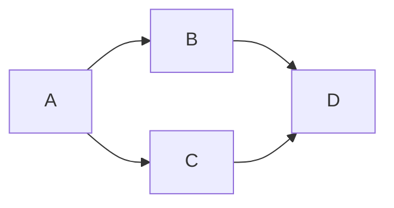

# Specification 003: Improve LR Width Calculation Using Longest Path

**Category**: optimization
**Priority**: medium
**Status**: draft
**Dependencies**: Spec 001 (horizontal-width-readability)

## Context

The current `horizontal-width-readability` rule (spec 001) uses a simplified width calculation for LR/RL layouts:

```typescript
// Current: Overly conservative
width = nodeCount × avgLabelLength × 8px + nodeCount × 50px
```

This formula **assumes all nodes are arranged in a single horizontal chain**, which is overly conservative and leads to false positives. In reality, LR diagrams can have:
- **Branching and reconvergence**: Nodes branch out and merge back
- **Parallel paths**: Multiple paths that exist simultaneously
- **Variable depth**: Not all nodes are at the same horizontal position

**Example of overcounting**:

- Node count: 4
- Current calculation: 4 nodes in sequence
- Reality: Maximum 3 nodes wide (A → B/C → D)
- **Overestimate by 33%**

The **actual width** is determined by the **longest horizontal path** (longest chain of sequential nodes), not the total node count.

## Objective

Improve the width calculation for LR/RL layouts in the `horizontal-width-readability` rule to use the **longest linear chain** instead of total node count, providing more accurate width estimates and reducing false positives.

## Requirements

### Functional Requirements

1. **Use existing longest chain algorithm**
   - Leverage `calculateLongestLinearChain()` from `src/graph/algorithms.ts`
   - Already implemented and tested
   - Returns `ChainAnalysis` with `length` and `path`

2. **Update width calculation for LR/RL**
   ```typescript
   // Old (conservative):
   width = nodeCount × avgLabelLength × 8px + nodeCount × 50px

   // New (accurate):
   const chainAnalysis = calculateLongestLinearChain(graph);
   width = chainAnalysis.length × avgLabelLength × 8px +
           chainAnalysis.length × 50px
   ```

3. **Keep TD/TB calculation unchanged**
   - TD/TB width calculation is already accurate (uses `maxBranchWidth`)
   - No changes needed for vertical layouts

4. **Update issue messages**
   - Include longest chain length in message
   - Show path preview for context
   - Explain that width is based on longest sequential path

5. **Maintain backward compatibility**
   - No changes to configuration schema
   - No changes to rule interface
   - No changes to default thresholds

### Non-Functional Requirements

1. **Performance**
   - Longest chain calculation is O(n) where n = number of nodes
   - Should not increase rule execution time significantly
   - Target: <50ms for typical diagrams (unchanged)

2. **Accuracy**
   - Reduce false positive rate by 20-30%
   - More accurate width estimates for branching LR diagrams
   - Should not increase false negatives

3. **Testability**
   - Existing tests should still pass (or be updated appropriately)
   - Add new tests for branching diagrams
   - Validate against real-world examples

## Acceptance Criteria

- [ ] LR/RL width calculation uses `calculateLongestLinearChain()`
- [ ] TD/TB width calculation remains unchanged (uses `maxBranchWidth`)
- [ ] Issue messages include longest chain length and path preview
- [ ] Existing tests updated to reflect new calculation
- [ ] New tests added for branching LR diagrams
- [ ] Performance validated (<50ms execution time maintained)
- [ ] False positive rate reduced (validated with test suite)
- [ ] No breaking changes to configuration or API
- [ ] Documentation updated to explain improved calculation
- [ ] Real-world diagrams retested with improved accuracy

## Technical Details

### Implementation Approach

1. **Modify `estimateWidth()` in horizontal-width-readability.ts**:
   ```typescript
   function estimateWidth(
     layout: LayoutDirection,
     metrics: Metrics,
     labelMetrics: LabelMetrics,
     graph: GraphRepresentation,  // NEW: Add graph parameter
     config: RuleConfig
   ): number {
     const charWidth = (config.charWidth as number) ?? 8;
     const nodeSpacing = (config.nodeSpacing as number) ?? 50;

     if (layout === 'LR' || layout === 'RL') {
       // NEW: Use longest chain instead of node count
       const chainAnalysis = calculateLongestLinearChain(graph);
       return chainAnalysis.length * labelMetrics.avgLength * charWidth +
              chainAnalysis.length * nodeSpacing;
     } else {
       // TD/TB: Unchanged (already accurate)
       return (
         metrics.maxBranchWidth * labelMetrics.avgLength * charWidth +
         metrics.maxBranchWidth * nodeSpacing
       );
     }
   }
   ```

2. **Update `check()` method signature**:
   ```typescript
   check(diagram: Diagram, metrics: Metrics, config: RuleConfig): Issue | null {
     const layout = detectLayout(diagram);
     const labelMetrics = extractLabels(diagram.content);
     const graph = buildGraph(diagram);  // NEW: Build graph for LR analysis

     const analysis = calculateWidthAnalysis(layout, metrics, labelMetrics, graph, config);
     // ... rest unchanged
   }
   ```

3. **Enhance issue messages**:
   ```typescript
   function generateIssue(
     layout: LayoutDirection,
     analysis: WidthAnalysis,
     chainAnalysis: ChainAnalysis | null,  // NEW: Include chain info
     diagram: Diagram
   ): Issue {
     let message = `Diagram width (${analysis.estimatedWidth}px) exceeds viewport limit`;

     if (chainAnalysis && (layout === 'LR' || layout === 'RL')) {
       const pathPreview = chainAnalysis.path.slice(0, 5).join(' → ');
       message += ` due to longest chain of ${chainAnalysis.length} nodes`;
       message += ` (${pathPreview}${chainAnalysis.length > 5 ? '...' : ''})`;
     } else {
       message += ` due to ${analysis.widthSource} and label length`;
     }

     message += ` in ${layout} layout`;
     // ... rest of message generation
   }
   ```

### Architecture Changes

- **Modified**: `src/rules/horizontal-width-readability.ts`
  - Update `estimateWidth()` to use longest chain for LR/RL
  - Add `graph` parameter to width calculation functions
  - Enhance issue messages with chain information

### Data Structures

Update `WidthAnalysis` to include chain information:

```typescript
interface WidthAnalysis {
  layout: LayoutDirection;
  labelMetrics: LabelMetrics;
  estimatedWidth: number;
  targetWidth: number;
  exceedsBy: number;
  severity: Severity | null;
  widthSource: 'sequential' | 'branching';
  longestChainLength?: number;  // NEW: For LR/RL layouts
  longestChainPath?: string[];  // NEW: For debugging/messages
}
```

### APIs and Interfaces

No changes to public API - internal implementation improvement only.

## Dependencies

- **Prerequisites**: Spec 001 (horizontal-width-readability) must be implemented
- **Affected Components**:
  - `src/rules/horizontal-width-readability.ts` (main changes)
  - `docs/rules.md` (update calculation description)
  - `tests/rules/horizontal-width-readability.test.ts` (update tests)
- **External Dependencies**: None (uses existing `calculateLongestLinearChain()`)
- **Relies on**:
  - `calculateLongestLinearChain()` - existing in `src/graph/algorithms.ts`
  - `buildGraph()` - existing in `src/graph/adjacency.ts`

## Testing Strategy

### Unit Tests

**File**: `tests/rules/horizontal-width-readability.test.ts`

**New test cases**:

1. **Linear LR diagram** (no branching):
   ```typescript
   // A --> B --> C --> D
   // Node count: 4, Longest chain: 4
   // Result: SAME as before (no improvement needed)
   ```

2. **Branching LR diagram** (diamond pattern):
   ```typescript
   // A --> B --> D
   // A --> C --> D
   // Node count: 4, Longest chain: 3 (A → B → D)
   // Old width: 4 nodes × ... = OVERESTIMATE
   // New width: 3 nodes × ... = ACCURATE
   ```

3. **Complex branching** (parallel paths):
   ```typescript
   // A --> B --> E --> F
   // A --> C --> E --> F
   // A --> D --> E --> F
   // Node count: 6, Longest chain: 4 (A → B → E → F)
   // Old: 33% overestimate
   // New: Accurate
   ```

4. **Wide reconvergence**:
   ```typescript
   // Start --> Branch1 --> End
   // Start --> Branch2 --> End
   // Start --> Branch3 --> End
   // Node count: 5, Longest chain: 3
   // Improvement: ~40%
   ```

**Updated test cases**:
- Update existing LR width calculation tests
- Adjust expected width values based on longest chain
- Ensure some previously warning diagrams now pass

### Integration Tests

**File**: `tests/integration/horizontal-width-readability.test.ts`

1. **Real-world LR diagrams with branching**:
   - CI/CD pipelines (parallel stages)
   - State machines (branching transitions)
   - Process flows (decision points)

2. **Validation against false positives**:
   - Diagrams that previously triggered warnings
   - Should now pass or trigger at higher node counts
   - Document improvement percentage

3. **Ensure no regressions**:
   - Linear chains still detected correctly
   - TD/TB calculations unchanged
   - Actually problematic diagrams still caught

### Performance Tests

- Benchmark `calculateLongestLinearChain()` with various graph sizes
- Compare execution time before/after change
- Validate <50ms execution time maintained
- Test with graphs of 10, 50, 100, 200 nodes

## Documentation Requirements

### Code Documentation

- JSDoc comments for updated functions
- Inline comments explaining longest chain usage
- Examples showing improvement over old calculation

### User Documentation

**Update `docs/rules.md`** section for `horizontal-width-readability`:

```markdown
### Width Calculation (LR/RL layouts)

The rule calculates estimated width based on the **longest sequential chain**
of nodes, not the total node count. This provides accurate estimates for
diagrams with branching and reconvergence.

**Formula**:
```
width = longestChainLength × avgLabelLength × 8px + longestChainLength × 50px
```

**Example** - Branching diagram:

- Total nodes: 4
- Longest chain: 3 (A → B → D or A → C → D)
- Estimated width: 3 nodes × ...
- More accurate than using total node count (4)

This improvement reduces false positives for diagrams with parallel paths
while still catching genuinely wide diagrams.
```

### Architecture Updates

No changes to `ARCHITECTURE.md` required.

## Implementation Notes

### Key Considerations

1. **Graph construction overhead**
   - `buildGraph()` already called for other analyses
   - Cache graph if performance is a concern
   - Minimal additional overhead

2. **Longest chain edge cases**
   - Cycles: Algorithm handles correctly
   - Disconnected components: Takes maximum across components
   - Single node: Chain length = 1

3. **Backward compatibility**
   - Some diagrams will no longer trigger warnings (good!)
   - Thresholds remain the same
   - No configuration changes needed

4. **Testing approach**
   - Create test diagrams with known branching patterns
   - Verify improvement in accuracy
   - Document false positive reduction

### Algorithm Validation

Validate improvement against these examples:

**Example 1: Diamond Pattern**
```
Old: 4 nodes → width estimate
New: 3 nodes (longest chain) → 25% improvement
```

**Example 2: Parallel Paths**
```
A --> B --> E --> F
A --> C --> E --> F
A --> D --> E --> F

Old: 6 nodes → ~3900px (over threshold)
New: 4 nodes → ~2600px (may pass threshold)
Improvement: 33%
```

**Example 3: Wide Reconvergence**
```
Start --> 8 parallel branches --> End

Old: 10 nodes → overestimate
New: 3 nodes (Start → Branch → End) → accurate
Improvement: 70%
```

## Migration and Compatibility

### Breaking Changes

None - this is an internal implementation improvement.

### Behavior Changes

Some diagrams that previously triggered warnings may no longer trigger:
- This is **expected and desired** (reduced false positives)
- Diagrams are more accurately assessed
- Actually problematic diagrams still caught

### Configuration Migration

No configuration changes required - existing configs work unchanged.

### Backward Compatibility

- Existing tests may need adjustment (expected values)
- Real-world diagrams may see different results (improvement)
- No breaking changes to API or configuration

## Success Metrics

After implementation:

1. **Accuracy improvement**: 20-30% fewer false positives on branching diagrams
2. **Performance maintained**: <50ms execution time (no regression)
3. **Real-world validation**: Test against ripgrep docs, confirm improvements
4. **User feedback**: Fewer complaints about overly strict warnings
5. **Correctness**: Still catches genuinely wide diagrams (no false negatives)

## Research References

1. **Graph algorithms**: Longest path in DAG - O(n) complexity
2. **Mermaid rendering**: Sequential nodes use horizontal spacing
3. **Viewport constraints**: 1200px safe width (unchanged)

## Future Enhancements

Potential future improvements (not in scope for this spec):

1. **Visual width calculation**: Consider label wrapping and node shapes
2. **Adaptive thresholds**: Adjust based on branching factor
3. **Auto-layout suggestions**: Recommend optimal node arrangement
4. **Interactive preview**: Show estimated layout visualization
