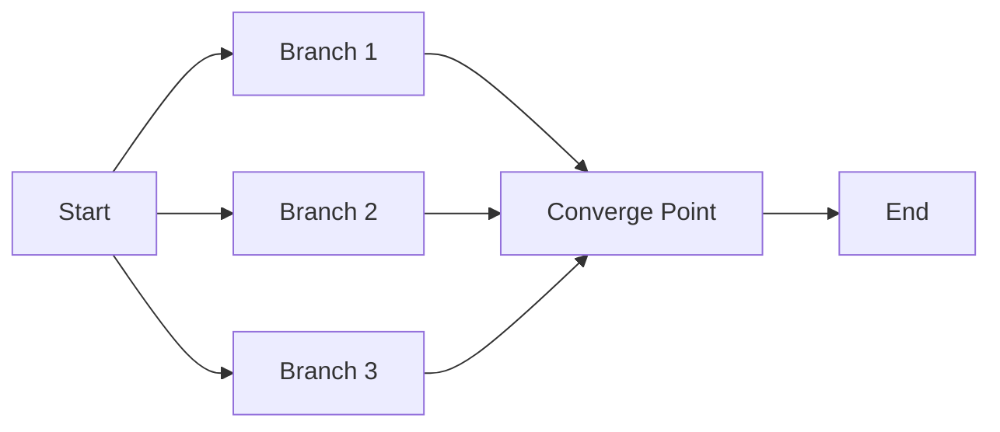

# Branching LR Layout Test Fixture

This fixture tests the horizontal-width-readability rule for LR layouts with branching.
The diagram has branching and reconvergence, so the longest chain should be shorter than the total node count.

Total nodes: 6
Longest chain: 3 (START → BRANCH1 → CONVERGE → END or similar)
Old calculation would use 6 nodes (overestimate)
New calculation uses 3 nodes (accurate)
