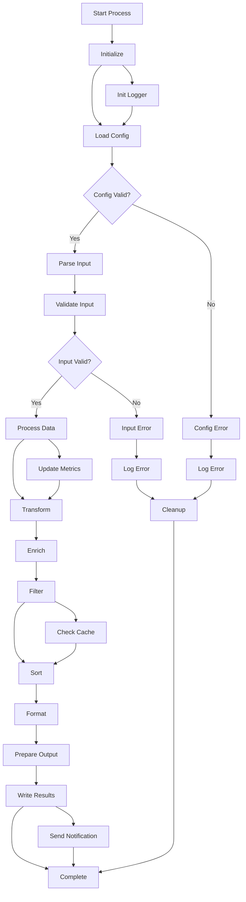

# Clean Test Fixture

This diagram has 30 nodes, 35 edges, and 2 decision nodes. It should not trigger any rules.

```mermaid
graph TD
    Start[Start Process]
    Start --> A[Initialize]
    A --> B[Load Config]
    B --> C{Config Valid?}
    C -->|Yes| D[Parse Input]
    C -->|No| Error1[Config Error]
    D --> E[Validate Input]
    E --> F{Input Valid?}
    F -->|Yes| G[Process Data]
    F -->|No| Error2[Input Error]
    G --> H[Transform]
    H --> I[Enrich]
    I --> J[Filter]
    J --> K[Sort]
    K --> L[Format]
    L --> M[Prepare Output]
    M --> N[Write Results]
    N --> Complete[Complete]
    Error1 --> Recovery1[Log Error]
    Error2 --> Recovery2[Log Error]
    Recovery1 --> Cleanup
    Recovery2 --> Cleanup
    Cleanup --> Complete
    G --> Metrics[Update Metrics]
    Metrics --> H
    J --> Cache[Check Cache]
    Cache --> K
    N --> Notify[Send Notification]
    Notify --> Complete
    A --> Logger[Init Logger]
    Logger --> B
```
