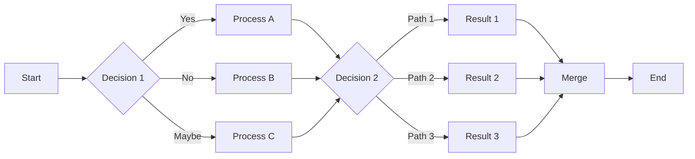

# Complex Branching Flow

This is a more complex flowchart with branching and reconvergence.

```mermaid
flowchart LR
    A[Start] --> B{Decision 1}
    B -->|Yes| C[Process A]
    B -->|No| D[Process B]
    B -->|Maybe| E[Process C]

    C --> F{Decision 2}
    D --> F
    E --> F

    F -->|Path 1| G[Result 1]
    F -->|Path 2| H[Result 2]
    F -->|Path 3| I[Result 3]

    G --> J[Merge]
    H --> J
    I --> J

    J --> K[End]
```

Expected metrics:
- Nodes: 11
- Edges: 14
- Max Branch Width: 3
