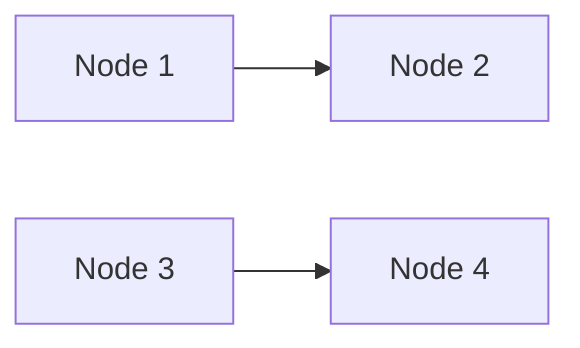

# Edge Cases

## Empty Diagram

```mermaid
flowchart TD
```

## Single Node


## Disconnected Components



## Multiple Diagrams

First diagram:


Second diagram:

~~~mermaid
flowchart LR
    Y[Second] --> Z[End]
~~~
