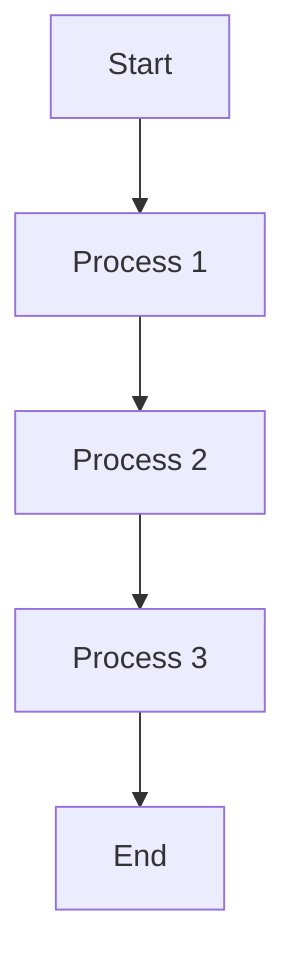

# Simple Linear Flow

This is a simple linear flowchart with 5 nodes and 4 edges.

Expected metrics:
- Nodes: 5
- Edges: 4
- Density: 0.2 (4 / (5 × 4) = 0.2)
- Max Branch Width: 1
- Average Degree: 1.6 (8 / 5)
