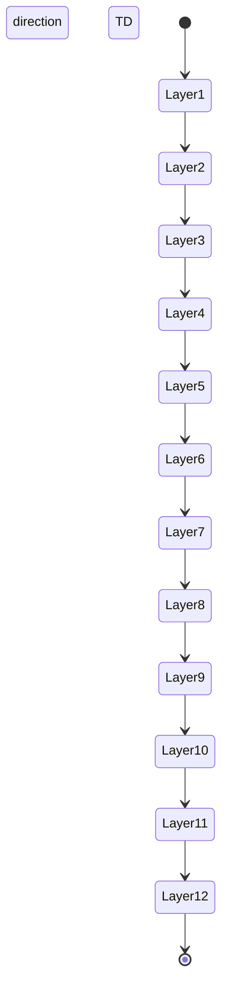

# Deep TD State Diagram

This is a deep TD layout state diagram that should trigger vertical height warnings.

Expected issues:
- Should trigger vertical-height-readability warning
- Deep graph with 14 levels (including start/end)
