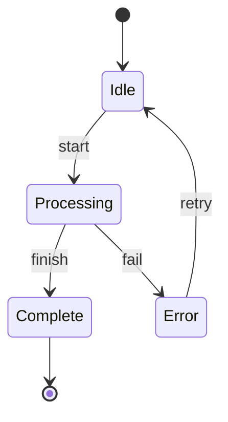

# State Diagram with Labeled Transitions

This tests state diagrams with colon-labeled transitions.

Expected metrics:
- Nodes: 6 (including __START__ and __END__)
- Edges: 6
- Diagram Type: state
- All transitions should have labels
