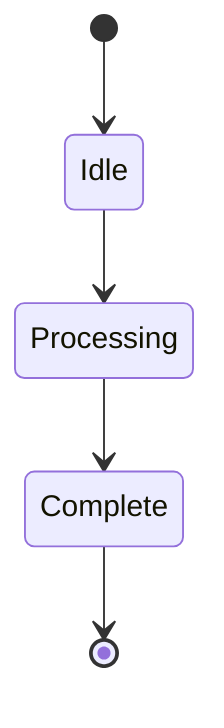

# Simple State Diagram

This is a simple state diagram with basic transitions.

```mermaid
stateDiagram-v2
    [*] --> Idle
    Idle --> Processing
    Processing --> Complete
    Complete --> [*]
```

Expected metrics:
- Nodes: 4 (including __START__ and __END__)
- Edges: 4
- Diagram Type: state
