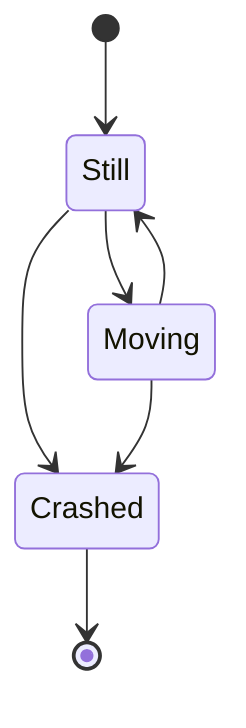

# State Diagram v1 Syntax

This tests the stateDiagram v1 syntax (without -v2 suffix).

```mermaid
stateDiagram
    [*] --> Still
    Still --> Moving
    Still --> Crashed
    Moving --> Still
    Moving --> Crashed
    Crashed --> [*]
```

Expected metrics:
- Nodes: 5 (including __START__ and __END__)
- Edges: 6
- Diagram Type: state
