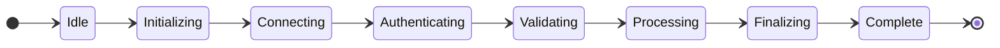

# Wide LR State Diagram

This is a wide LR layout state diagram that should trigger horizontal width warnings.

Expected issues:
- Should trigger horizontal-width-readability warning
- Wide sequential chain in LR layout
